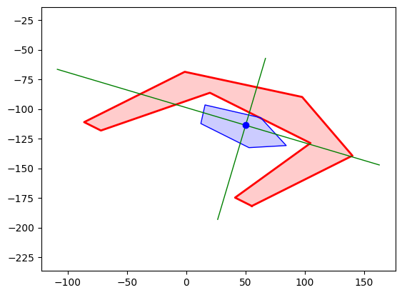
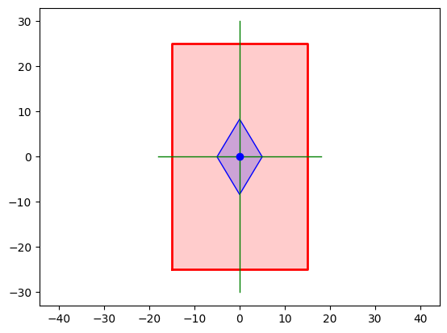

# pyco handleiding

Begin alle documenten met onderstaande import.


```python
import pyco as pc
```

De pyco bibliotheek is afhankelijk van onderstaande externe bibliotheken:

* numpy (https://numpy.org) beschikbaar via `pc.np`
* pandas (https://pandas.pydata.org/) beschikbaar via `pc.pd`
* matplotlib (https://matplotlib.org/) pyplot module beschikbaar via `pc.plt`
* IPython (https://ipython.org/) voor printen/plotten van uitvoer in Jupyter notebook

## Inhoud
Alle pyco klasses beginnen met een hoofdletter. Alle functies en eigenschappen beginnen met een kleine letter.

* [Waarde](#Waarde)
* [Lijst](#Lijst)
* [Data](#Data)
* [Knoop](#Knoop)
* [Lijn](#Lijn)
* [Vorm](#Vorm)
    - [Rechthoek](#Rechthoek)
    - [Cirkel](#Cirkel)
* [Figuur](#Figuur)
* [Materiaal](#Materiaal)
* [Document](#Document)
* [Macro](#Macro)
* [pyco functies en eigenschappen](#Functies)

## Waarde

[terug naar inhoudsopgave](#Inhoud)


```python
pc.Waarde.print_help()
```

    
    +----------+
    |  Waarde  |
    +----------+
    
    Bevat een getal en bijhorende eenheid.
    
    AANMAKEN WAARDE
        w = Waarde(getal)
        w = Waarde(getal, eenheid_tekst)
        w2 = w.kopie()          maak een kopie (nieuw object) met zelfde eigenschappen    
    
    AANPASSEN EENHEID           omzetten van eenheid naar andere eenheid
        w.eenheid               huidige eenheid opvragen (tekst of None)
        w.eenheid = 'N/mm2'     eenheid aanpassen
        w = w['N/mm2']          eenheid aanpassen, retourneert object
        w.gebruik_eenheid('mm') eenheid aanpassen, retourneert object
        w.eh('mm')              eenheid aanpassen, retourneert object
        w = w.N_mm2             kan voor een aantal standaard gevallen (zie lijst onderaan)
    
    AANPASSEN AFRONDING         pas afgerond wanneer waarde wordt getoond als tekst
        w = w[0]                kan voor alle gehele getallen
        w = w._0                kan voor 0 t/m 9 (cijfers achter de komma)
    
    OMZETTEN WAARDE NAAR TEKST  resulteert in nieuw string object
                                    -> gebruikt afronding indien opgegeven
        tekst = str(w)          of automatisch met bijvoorbeeld print(w)
        tekst = format(w,'.2f') format configuratie meegeven voor getal
              = w.format('.2f')
    
    OMZETTEN WAARDE NAAR GETAL  resulteert in nieuw float object
        getal = float(w)        omzetten met standaard eenheid
        getal = float(w['eh'])  eerst eenheid definiëren voor omzetten waarde
    
    MOGELIJKE BEWERKINGEN       resulteert in nieuw Waarde object
        w3 = w1 + w2            waarde optellen bij waarde
        w3 = w1 - w2            waarde aftrekken van waarde
        w3 = w1 * w2            waarde vermenigvuldigen met waarde
        w3 = w1 / w2            waarde delen door waarde
        w2 = n * w1             getal vermenigvuldigen met waarde
        w2 = w1 * n             waarde vermenigvuldigen met getal
        w2 = n / w1             getal delen door waarde
        w2 = w1 / n             waarde delen door getal
        w2 = w1 ** n            waarde tot de macht een geheel getal
        w2 = abs(w1)            maakt waarde altijd positief
        w2 = +w1                behoud teken
        w2 = -w1                verander teken (positief vs. negatief)
    
    WAARDEN VERGELIJKEN         resulteert in een boolean (True/False)
        w1 == w2                is gelijk aan
        w1 == getal             de float() van waarde is gelijk aan getal
        w1 != w2                is niet gelijk aan
        w1 >  w2                is groter dan
        w1 <  w2                is kleiner dan
        w1 >= w2                is groter dan of gelijk aan
        w1 <= w2                is kleiner dan of gelijk aan
        w1 &  w2                eenheden zijn zelfde type
        
    WISKUNDIGE FUNCTIES         
        w.sin()                 sinus (alleen getallen en hoeken)
        w.cos()                 cosinus (alleen getallen en hoeken)
        w.tan()                 tangens (alleen getallen en hoeken)
        w.asin()                arcsinus (omgekeerde sin, alleen getallen)
        w.acos()                arccosinus (omgekeerde cos, alleen getallen)
        w.atan()                arctangens (omgekeerde tan, alleen getallen)
        w.sinh()                hyperbolische sinus (getallen en hoeken)
        w.cosh()                hyperbolische cosinus (getallen en hoeken)
        w.tanh()                hyperbolische tangens (getallen en hoeken)
        w.asinh()               arcsinus hyperb. (omgekeerde asinh, getallen)
        w.acosh()               arccosinus hyperb. (omgekeerde acosh, getallen)
        w.atanh()               arctangens hyperb. (omgekeerde atanh, getallen)
        w.afronden(n)           rond af op n decimalen (standaard 0)
        w.plafond()             rond af naar boven (geheel getal)
        w.vloer()               rond af naar beneden (geheel getal)
        w.plafond_0_vloer()     rond af richting 0 (geheel getal)
        w1.optellen(w2)         w1 + w2
        w1.aftrekken(w2)        w1 - w2
        w1.vermenigvuldigen(w2) w1 * w2
        w1.delen(w2)            w1 / w2
        w1.delen_aantal(w2)     afgerond naar beneden
        w1.delen_rest(w2)       restant na afronden naar beneden
        w.macht(n)              w ** n
        w.reciproke()           1 / w
        w.negatief()            -w
        w.exp()                 exponentieel: berekent e^w
        w.ln()                  natuurlijke logaritme (grondgetal e)
        w.log()                 logaritme met grondgetal 10
        w.wortel()              vierkantswortel
        w.wortel3()             kubieke wortel
        w.absoluut()            absolute waarde (altijd positief)
        w.teken()               positief getal: 1.0, nul: 0.0, negatief: -1.0 
        w.kopieer_teken(w2)     neem huidige, met het teken (+-) van w2
        w.is_nan()              bepaalt of waarde een niet-getal is
        w.is_inf()              bepaalt of waarde oneindig is
    
    EENHEID TEKST
        gebruik getal achter standaard eenheid voor 'tot de macht' (bijv. mm3)
        gebruik / (maximaal één keer) om teller en noemer te introduceren
        gebruik * om eenheden te combineren (zowel in teller als noemer)
        bijvoorbeeld: "m3*kPa/s4*m"
    
    STANDAARD EENHEDEN          deze kan je combineren in een eenheid tekst
        dimensieloos            -
        massa                   ag fg pg ng mug mg cg g hg kg Mg Gg Tg Pg Eg
                                ton kton Mton ounce pound kip stone grain
        lengte                  am fm pm nm mum mm cm dm m dam hm km Mm Gm Tm
                                Pm Em in ft yard zeemijl mijl
        tijd                    as(.attos) fs ps ns mus ms cs ds s das hs ks
                                Ms Gs Ts Ps Es min(.minuut) h d j
        temperatuur             C K F  (als temperatuur in teller, samen met
                                andere eenheden, dan niet om te rekenen)
        hoek                    rad deg gon
        kracht                  N kN MN GN TN  (of massa*lengte/tijd^2)
        spanning                Pa kPa MPa GPa TPa  (of kracht/oppervlakte)
        moment                  Nm kNm MNm Nmm kNmm MNmm  (of kracht*lengte)
        oppervlakte             ca a ha  (of lengte^2)
        inhoud                  ml cl dl l dal hl kl gallon pint floz tbs tsp
                                bbl cup  (of lengte^3)
    
    BESCHIKBARE EIGENSCHAPPEN   voor snel toekennen van eenheid aan waarde
    <object>.<eigenschap>       bijvoorbeeld toekennen inhoud: w.dm3
    a ag am attos bbl C ca cg cl cl_d cl_h cl_j cl_min cl_s cm cm2 cm3 cm3_d
    cm3_h cm3_j cm3_min cm3_s cm4 cm_d cm_h cm_j cm_min cm_s cs cup d dal dam
    das deg dg dl dl_d dl_h dl_j dl_min dl_s dm dm2 dm3 dm3_d dm3_h dm3_j
    dm3_min dm3_s dm4 dm_d dm_h dm_j dm_min dm_s ds Eg Em Es F fg floz fm fs ft
    g gallon Gg Gm GN gon GPa grain Gs h ha hg hl hm hm2 hm3 hs inch K kg kip
    kl km km2 km3 km3_d km3_h km3_j km3_min km3_s km4 km_d km_h km_j km_min
    km_s kN kNm kNmm kN_m kN_mm kN_m2 kN_mm2 kPa ks kton l l_d l_h l_j l_min
    l_s m m2 m3 m3_d m3_h m3_j m3_min m3_s m4 Mg mg mijl minuut ml ml_d ml_h
    ml_j ml_min ml_s Mm mm mm2 mm3 mm3_d mm3_h mm3_j mm3_min mm3_s mm4 mm_d
    mm_h mm_j mm_min mm_s MN MNm MNmm MN_m2 MN_mm2 MPa Ms ms Mton mug mum mus
    m_d m_h m_j m_min m_s N ng Nm nm Nmm ns N_m N_mm N_m2 N_mm2 ounce Pa Pg pg
    pint Pm pm pound Ps ps rad s stone tbs Tg Tm TN ton TPa Ts tsp yard zeemijl
    
    


```python
# pc.Waarde is ook beschikbaar onder pc.W
print(f"12 dm + 58 cm = { (pc.W(12).dm + pc.W(58).cm).mm }")
print(f"pi radialen komt overeen met: { pc.W(3.141592654, 'rad').deg }")
print(f"1 meter per 10 graden Celsius komt overen met: { pc.W(1/10, 'm/C')['cm/F'] }")
```

    12 dm + 58 cm = 1780.0000000000002 mm
    pi radialen komt overeen met: 180.00000002350313 deg
    1 meter per 10 graden Celsius komt overen met: 5.5555555555555545 cm/F
    

## Lijst

[terug naar inhoudsopgave](#Inhoud)


```python
pc.Lijst.print_help()
```

    
    +---------+
    |  Lijst  |
    +---------+
    
    Bevat een aantal getallen of Waarde objecten met allen dezelfde eenheid.
    
    AANMAKEN LIJST              eenheid van 1e component, geldt voor geheel
        l = Lijst(waarde1, waarde2, ...)          waarde: float, int of Waarde
        l = Lijst([waarde1, waarde2, ...])              
        l = Lijst(numpy_array)             array wordt indien nodig 1D gemaakt
        l2 = l.kopie()          maak een kopie (nieuw object) met zelfde eigenschappen 
    
    AANPASSEN EENHEID           omzetten van eenheid naar andere eenheid
        l.eenheid               huidige eenheid opvragen (tekst of None)
        l.eenheid = 'N/mm2'     eenheid aanpassen
        l.gebruik_eenheid('m')  eenheid aanpassen, retourneert object
        l.eh('m')               eenheid aanpassen, retourneert object
        l = l.N_mm2             kan voor een aantal standaard gevallen (zie lijst onderaan)
    
    OMZETTEN LIJST NAAR TEKST   resulteert in nieuw string object
        tekst = str(l)          of automatisch met bijvoorbeeld print(l)
        tekst = format(l, '.2f') format configuratie meegeven voor getal
              = l.format('.2f')
    
    MOGELIJKE BEWERKINGEN       resulteert in nieuw Lijst object
        l3 = l1 + l2            lijst optellen bij lijst
        l3 = l1 - l2            lijst aftrekken van lijst
        getal = l1 * l2         lijst vermenigvuldigen met lijst (inproduct)
        getal = l1 / l2         lijst delen door lijst (inverse inproduct)
        l2 = n * l1             getal vermenigvuldigen met lijst
        l2 = l1 * n             lijst vermenigvuldigen met getal
        l2 = n / l1             getal delen door lijst
        l2 = l1 / n             lijst delen door getal
        l2 = l1 ** n            lijst tot de macht een geheel getal
        waarde = abs(l1)        berekent lengte van lijst -> Waarde object
        getal = float(l1)       berekent lengte van lijst -> float object
        l2 = +l1                behoud teken
        l2 = -l1                verander teken (positief vs. negatief)
        for w in l1:            itereert en geeft float/Waarde object terug
        getal = len(l1)         geeft aantal elementen (dimensies) van lijst
        
    ELEMENT UIT LIJST HALEN
        waarde = l1.i(1)        retourneert het i-ste element als Waarde object
                                                (1e element is element nummer 0)
    
    NUMPY BEWERKINGEN           gebruikt array object
        numpy_array = l1.array  retourneert Numpy array object
                                    (bevat allen getallen, zonder eenheid)
        getal = l1[2]           retourneert getal (zonder eenheid) op index
        numpy_array = l1[1:3]   retourneert Numpy array object vanuit slice
    
    WAARDEN VERGELIJKEN         resulteert in een boolean (True/False)
        l1 == l2                de totale lijst is gelijk aan
        l1 != l2                de totale lijst is niet gelijk aan
        l1 >  l2                de absolute waarde van lijst is groter dan
        l1 <  l2                de absolute waarde van lijst is kleiner dan
        l1 >= l2                de absolute waarde van lijst is groter dan of gelijk aan
        l1 <= l2                de absolute waarde van lijst is kleiner dan of gelijk aan
        l1 &  l2                eenheden zijn zelfde type
        
    WISKUNDIGE FUNCTIES         
        l.sin()                 sinus (alleen getallen en hoeken)
        l.cos()                 cosinus (alleen getallen en hoeken)
        l.tan()                 tangens (alleen getallen en hoeken)
        l.asin()                arcsinus (omgekeerde sin, alleen getallen)
        l.acos()                arccosinus (omgekeerde cos, alleen getallen)
        l.atan()                arctangens (omgekeerde tan, alleen getallen)
        l.sinh()                hyperbolische sinus (getallen en hoeken)
        l.cosh()                hyperbolische cosinus (getallen en hoeken)
        l.tanh()                hyperbolische tangens (getallen en hoeken)
        l.asinh()               arcsinus hyperb. (omgekeerde asinh, getallen)
        l.acosh()               arccosinus hyperb. (omgekeerde acosh, getallen)
        l.atanh()               arctangens hyperb. (omgekeerde atanh, getallen)
        l.afronden(n)           rond af op n decimalen (standaard 0)
        l.plafond()             rond af naar boven (geheel getal)
        l.vloer()               rond af naar beneden (geheel getal)
        l.plafond_0_vloer()     rond af richting 0 (geheel getal)
        l.som()                 de som van de elementen
        l.product()             het product van de elementen
        l.verschil()            lijst met verschillen tussen elementen
        l1.optellen(l2)         l1 + l2
        l1.aftrekken(l2)        l1 - l2
        l1.vermenigvuldigen(l2) l1 * l2
        l1.delen(l2)            l1 / l2
        l1.delen_aantal(l2)     afgerond naar beneden
        l1.delen_rest(l2)       restant na afronden naar beneden
        l.macht(n)              l ** n
        l.reciproke()           1 / l
        l.negatief()            -l
        l1.kruisproduct(l2)     l1 x l2: staat loodrecht op vector l1 en l2
        l1.inwendigproduct(l2)  l1 . l2: is |l1| * |l2| * cos(theta)
        l.exp()                 exponentieel: berekent e^l
        l.ln()                  natuurlijke logaritme (grondgetal e)
        l.log()                 logaritme met grondgetal 10
        l.bijsnijden(min, max)  snij alle elementen af tot minmax bereik
        l.wortel()              vierkantswortel
        l.wortel3()             kubieke wortel
        l.absoluut()            absolute waarde (altijd positief)
        l.teken()               positief getal: 1.0   negatief: -1.0 
        l.kopieer_teken(l2)     neem huidige, met het teken (+-) van l2
        l.verwijder_nan()       verwijder niet-getallen (not a number)
        l.getal_nan_inf()       vervang: nan=0, inf=1.7e+308 (heel groot)
        l.cumulatief()          lijst met cumulatieve som van lijst
        l.gemiddelde()          bepaalt het gemiddelde
        l.stdafw_pop()          bepaalt standaardafwijking voor populatie
        l.stdafw_n()            bepaalt standaardafwijking steekproef
        l.mediaan()             bepaalt de mediaan
        l.percentiel(perc)      percentage: getal tussen 0 en 100
        l.correlatie(l2)        bepaalt correlatie matrix
        l.sorteer()             sorteert een lijst van klein naar groot
        l.omdraaien()           draai de volgorde van de lijst om
        l.is_nan()              bepaalt per element of een niet-getal is
        l.is_inf()              bepaalt per element of oneindig is
        l1.gelijk(l2)           per element: w1 == w2
        l1.niet_gelijk(l2)      per element: w1 != w2
        l1.groter(l2)           per element: w1 > w2
        l1.groter_gelijk(l2)    per element: w1 >= w2
        l1.kleiner(l2)          per element: w1 < w2
        l1.kleiner_gelijk(l2)   per element: w1 <= w2
        l.alle()                kijkt of alle elementen True zijn
        l.sommige()             kijkt of er minimaal 1 element True is
        l.niet_alle()           kijkt of er minimaal 1 element False is
        l.geen()                kijkt of alle elementen False zijn
        l.waar()                zet lijst om in list met True/False
        
    BESCHIKBARE EIGENSCHAPPEN   voor snel toekennen van eenheid aan waarde
    <object>.<eigenschap>       bijvoorbeeld toekennen inhoud: v.dm3
    a ag am attos bbl C ca cg cl cl_d cl_h cl_j cl_min cl_s cm cm2 cm3 cm3_d
    cm3_h cm3_j cm3_min cm3_s cm4 cm_d cm_h cm_j cm_min cm_s cs cup d dal dam
    das deg dg dl dl_d dl_h dl_j dl_min dl_s dm dm2 dm3 dm3_d dm3_h dm3_j
    dm3_min dm3_s dm4 dm_d dm_h dm_j dm_min dm_s ds Eg Em Es F fg floz fm fs ft
    g gallon Gg Gm GN gon GPa grain Gs h ha hg hl hm hm2 hm3 hs inch K kg kip
    kl km km2 km3 km3_d km3_h km3_j km3_min km3_s km4 km_d km_h km_j km_min
    km_s kN kNm kNmm kN_m kN_mm kN_m2 kN_mm2 kPa ks kton l l_d l_h l_j l_min
    l_s m m2 m3 m3_d m3_h m3_j m3_min m3_s m4 Mg mg mijl minuut ml ml_d ml_h
    ml_j ml_min ml_s Mm mm mm2 mm3 mm3_d mm3_h mm3_j mm3_min mm3_s mm4 mm_d
    mm_h mm_j mm_min mm_s MN MNm MNmm MN_m2 MN_mm2 MPa Ms ms Mton mug mum mus
    m_d m_h m_j m_min m_s N ng Nm nm Nmm ns N_m N_mm N_m2 N_mm2 ounce Pa Pg pg
    pint Pm pm pound Ps ps rad s stone tbs Tg Tm TN ton TPa Ts tsp yard zeemijl
    
    


```python
# pc.Lijst is ook beschikbaar onder pc.L
pc.L(0, 200, 1).cm
```


    Lijst(0.0, 200.0, 1.0).eh('cm')


## Data
[terug naar inhoudsopgave](#Inhoud)


```python
pc.Data.print_help()
```

    
    +--------+
    |  Data  |
    +--------+
    
    Een Pandas DataFrame waarbij eigenschappen een eenheid kunnen hebben.
    Eigenschap moet een geldige Python naam opmaak hebben en mag niet 'data' zijn.
    
    AANMAKEN DATA  
        d = Data(eigenschap1='eenheid1',           als eenheid dimensieloos:
                 eigenschap2='eenheid2')             dan gebruik '-', '' of None
        d = Data(eigenschap1='eh1', data=...)      direct toevoegen van data
                  
    DATA EIGENSCHAPPEN
        d.eigenschappen           lijst met aanwezige kolomnamen
        d.eenheden                lijst met eenheden die bij kolommen horen
        d.df                      Pandas DataFrame object 
        d.DataRij                 klasse die een rij met eigenschappen beschrijft
    
    DATARIJ
        DR = d.DataRij
        dr1 = DR(eigenschap1=waarde1, eigenschap2=waarde2)
        dr2 = DR(eigenschap2=waarde3, eigenschap1=waarde4)
        dr2.waardes()             retourneert een Python dict met Waarde objecten
        
    TOEVOEGEN DATA REGEL    in onderstaande gevallen: 4 eigenschappen (kolommen)
        d.toevoegen(d.DataRij( ... ))      een DataRij object
        d.toevoegen([7,5,3,1])             een Python list object
        d.toevoegen(4,5,6,7)               losse argumenten
        d.toevoegen(pc.Lijst(4,9,6,70))    een Lijst object
        d.toevoegen((14,15,16,17))         een Python tuple object
        d.toevoegen(1,2)                   2 laatste kolommen worden met
                                                   standaard waarde ingevuld (0)
        d.toevoegen(1,2,standaard=pc.nan)  andere standaard waarde
        d.toeveogen([(1,2,3,4), (3,4,5,6), (5,6,7,8)])  of 2D Python lijst/tuple
    
    OPHALEN DATA EIGENSCHAP       
        d['eigenschap1']          een Lijst object (kolom uit dataframe)
        d.eigenschap1             ook beschikbaar als attribuut van object
        d[0]                      Python list met waardes van 1e invoer (DataRij)
        d[3:8]                    Python list met waardes (in Datarij)
                                                            van 4e t/m 8e invoer
        d[::2]                    Python list met alle oneven rijnummers
        d[:, 1:3]                 Python list met 2e en 3e kolom
                                                  (alleen waarden, geen eenheid) 
                                                  
    METHODES
        d.coordinaten(eigenschap1, eigenschap2)
                                  retourneert een tuple met tuples (es1, es2)
    
    


```python
d = pc.Data(x='mm', N='kN', V='kN', M='kNm')
d.toevoegen([7,5,3,1])
d.toevoegen(4,5,6, 1)
d.toevoegen(pc.Lijst(4,9,6,70))
d.toevoegen(d.DataRij(V=14, N=15, x=16, M=17))
print(d)
print()
print('M is:', d.M)
print('eerste rij is:', d[0])
print('tweede rij heeft Waardes:', d[1].waardes())
```

         x    N    V     M
        mm   kN   kN   kNm
    0    7    5    3     1
    1    4    5    6     1
    2  4.0  9.0  6.0  70.0
    3   16   15   14    17
    
    M is: (1.0, 1.0, 70.0, 17.0) kNm
    eerste rij is: DataRij(x=7, N=5, V=3, M=1)
    tweede rij heeft Waardes: {'x': Waarde(4.0, 'mm'), 'N': Waarde(5.0, 'kN'), 'V': Waarde(6.0, 'kN'), 'M': Waarde(1.0, 'kNm')}
    

## Knoop

[terug naar inhoudsopgave](#Inhoud)


```python
pc.Knoop.print_help()
```

    
    +---------+
    |  Knoop  |
    +---------+
    
    Bevat een lijst van getallen of Waarde (x, y, en/of z) met lengte eenheid.
    
    AANMAKEN KNOOP              eenheid van 1e component, geldt voor geheel
        k = Knoop([x_waarde, y_waarde, z_waarde])   kan oneindig veel dimensies
    
    AANPASSEN EENHEID           omzetten van eenheid naar andere eenheid
        k.eenheid               huidige eenheid opvragen (tekst of None)
        k.eenheid = 'N/mm2'     eenheid aanpassen
        k.gebruik_eenheid('m')  zelfde als bovenstaande, retourneert object
    
    OMZETTEN KNOOP NAAR TEKST   resulteert in nieuw string object
        tekst = str(k)          of automatisch met bijvoorbeeld print(w)
        tekst = format(k,'.2f') format configuratie meegeven voor getal
    
    MOGELIJKE BEWERKINGEN       resulteert in nieuw Knoop object
        k3 = k1 + k2            knoop optellen bij knoop
        k3 = k1 - k2            knoop aftrekken van knoop
        k2 = n * k1             getal vermenigvuldigen met knoop
        k2 = k1 * n             knoop vermenigvuldigen met getal
        k2 = n / k1             getal delen door knoop
        k2 = k1 / n             knoop delen door getal
        k2 = +k1                behoud teken
        k2 = -k1                verander teken (positief vs. negatief)
        for w in k1:            itereert en geeft float/Waarde object terug
        Waarde/getal = k1.x     retourneert 1e element als Waarde object
        Waarde/getal = k1.y     retourneert 2e element als Waarde object
        Waarde/getal = k1.z     retourneert 3e element als Waarde object
        getal = len(k1)         geeft aantal elementen (dimensies) van knoop
    
    NUMPY BEWERKINGEN           gebruikt array object
        numpy_array = k1.array  retourneert Numpy array object
                                    (bevat allen getallen, zonder eenheid)
        getal = k1[2]           retourneert getal (zonder eenheid) op index
        numpy_array = k1[1:3]   retourneert Numpy array object vanuit slice
    
    WAARDEN VERGELIJKEN         resulteert in een boolean (True/False)
        k1 == k2                is gelijk aan
        k1 != k2                is niet gelijk aan
        k1 &  k2                eenheden zijn zelfde type
    
    


```python
k1 = pc.Knoop(20, 20, 100).gebruik_eenheid('cm')
k2 = pc.Knoop(0, 0.8, 1.5).gebruik_eenheid('m')
k3 = pc.Knoop(0, 0, 1000).gebruik_eenheid('mm')

print(f'k2 heeft een x-waarde [{k2.x}], een y-waarde [{k2.y}] en een z-waarde [{k2.z}]')
```

    k2 heeft een x-waarde [0.0 m], een y-waarde [0.8 m] en een z-waarde [1.5 m]
    

## Lijn

[terug naar inhoudsopgave](#Inhoud)


```python
pc.Lijn.print_help()
```

    
    +--------+
    |  Lijn  |
    +--------+
    
    Bevat een collectie met knopen, waartussen zich rechte lijnen bevinden.
    
    AANMAKEN LIJN               invoeren van één of meedere Knoop objecten
        Lijn(Knoop(Waarde(1).cm, Waarde(2).cm)))    begin Knoop object
        Lijn([1,2]) of Lijn((1,2))                  alleen begincoordinaat
        Lijn((1,2), (3,4), (5,6))                   alle knoopcoordinaten
    
    AANPASSEN EENHEID
        l = Lijn((1,2), (3,4))
        l.eenheid               opvragen huidige eenheid; in dit geval None
        l.eenheid = 'm'         alle waarden in alle knoopobjecten naar 'm'
        l.gebruik_eenheid('m')  zelfde als bovenstaande, retourneert object
    
    OMZETTEN LIJN NAAR TEKST    resulteert in nieuw string object
        tekst = str(l)          of automatisch met bijvoorbeeld print(l)
        tekst = format(l,'.2f') format configuratie meegeven voor getal
    
    VERLENGEN LIJN              vanuit laatste knoop (of enige beginknoop)
        l.lijn_recht(naar=(3,4))
            rechte lijn naar een nieuwe knoop
    
        l.lijn_bezier(richting=(3,4), naar=(5,6), stappen=100)
            (kwadratische) Bezier kromme (met één richtingspunt) naar nieuwe
            knoop waarbij de kromme lijn omgezet wordt in aantal (stappen)
            rechte lijnen; standaard 100 stappen
    
        l.lijn_cirkelboog(middelpunt=(3,4), gradenhoek=-90, stappen=100)
            cirkelboog met opgegeven cirkel middelpunt over aantal opgegeven
            graden (waarbij 360 is gehele cirkel tekenen; positief is tegen
            klok in; negatief getal is met de klok mee) waarbij kromme lijn
            omgezet wordt in aantal rechte lijnen; standaard 100 stappen
    
    TRANSFORMEREN LIJN
        l.transformeren(       # standaard zijn alle parameters None
            rotatiepunt=[0,0], # xy Knoop/list; als None dan zwaartepunt vorm
            rotatiehoek=20,    # in graden, positief is tegen de klok in
            schaalfactor=2,  # Waarde/getal: vergrootfactor t.o.v. rotatiepunt
            schaalfactor=[2,3],# of Lijst/list met x-schaalfactor en y-factor
            schaalfactor=[1,-1],# verticaal spiegelen
            schaalfactor=[-1,1],# horizontaal spiegelen
            schaalfactor=[-5,3],# bovenstaande combineren
            translatie=[10,5], # xy verschuiven (na roteren en schalen)
        )
    
    MOGELIJKE BEWERKINGEN
        waarde = abs(l)         berekent lengte lijnstukken -> Waarde object
        getal = float(l)        berekent lengte lijnstukken -> float object
        for w in v1:            itereert en geeft Knoop object terug
        getal = len(v1)         geeft aantal knopen terug
    
    NUMPY BEWERKINGEN               gebruikt array object
        2D numpy_array = l1.array   retourneert volledige Numpy array object
                                      (bevat allen getallen, zonder eenheid)
        1D_numpy_array = l1[2]      retourneert knoopcoordinaten op index
        2D_numpy_array = l1[1:3]    retourneert knoopcoordinaten vanuit slice
    
    WAARDEN VERGELIJKEN         resulteert in een boolean (True/False)
        l1 == l2                is gelijk aan
        l1 != l2                is niet gelijk aan
        l1 &  l2                eenheden zijn zelfde type
    
    EXTRA OPTIES
        l.plot()                plot simpele 2D weergave van lijn
        l.plot3d()              plot simpele 3D weergave van lijn
    
        Lijn((4, -5), (-10, 10)).lijn_cirkelboog(middelpunt=(0,0),
            gradenhoek=+220, stappen=50).lijn_recht(naar=(4, 10)).lijn_bezier(
            richting=(-10,-4), naar=(4, -5)).plot()
    
    


```python
pc.Lijn(k1, k2, k3).plot3d()
```


    

    


## Vorm

[terug naar inhoudsopgave](#Inhoud)


```python
pc.Vorm.print_help()
```

    
    +--------+
    |  Vorm  |
    +--------+
    
    Betreft een meetkundig 2D vorm met bijbehorende eigenschappen.
    
    AANMAKEN VORM
        v1 = Vorm(Lijn)                 invoeren van één Lijn object
        v2 = Vorm([(0,0),(1,1),(1,0)])  direct invoeren knoopcoordinaten
    
    EENHEID
        v.eenheid       opvragen huidige eenheid; of None als alleen getal
        v.eenheid = 'm' alle waarden in alle knoopobjecten naar 'm'
        v.gebruik_eenheid('m')   zelfde als bovenstaande, retourneert object
    
    EIGENSCHAPPEN       naam + '_'  -->  Waarde object i.p.v. getal
        v.O             omtrek   (bijv. v.O_ geeft omtrek Waarde met eenheid)
        v.A             oppervlakte
        v.xmin v.xmax   minimum en maximum x-waarde
        v.ymin v.ymax   minimum en maximum y-waarde
        v.ncx  v.ncy    x- en y-waarde normaalkrachtencetrum (zwaartepunt)
        v.Ixx  v.Iyy    oppervlakte traagheidsmoment in x- en y-richting
        v.Ixy           traagheidsproduct (is 0 voor symmetrische vormen)
        v.I1   v.I2     hoofdtraagheidsmomenten (1 sterke richting, 2 zwakke)
        v.alpha         hoek (tegen klok in) hoofdtraagheidsassen
        v.Wxmin v.Wxmax weerstandsmoment voor vezel x-minimaal en x-maximaal
        v.Wymin v.Wymax weerstandsmoment voor vezel y-minimaal en y-maximaal
        v.kxmin v.kxmax laagste/hoogste x-waarde van kern
        v.kymin v.kymax laagste/hoogste y-waarde van kern
    
    KNOOP COORDINATEN
        v.array                 Numpy array met x/y coordinaten
        v.array_gesloten        zelfde, met kopie 1e knoop aan het einde
        v.kern_array            Numpy array met x/y coordinaten van kern
        v.kern_array_gesloten   zelfde, met kopie 1e knoop aan het einde
    
    LIJN OBJECT
        v.lijn        genereert een Lijn object van vorm omtrek (gesloten)
    
    BEWERKINGEN
        v[3]          subset Numpy array object met getallen (zonder eenheid)
        len(v)        aantal knopen
        for k in v:   itereert over knopen, geeft Knoop object (met eenheid)
    
    OVERIG
        v.plot()                Matplotlib plot met vormeigenschappen
        v.print_eigenschappen() print overzicht van eigenschappen
        v.print_eigenschappen(knopen=True)  zelfde, met lijst van knopen
    
    


```python
v1 = pc.Vorm(pc.Lijn([-50,-40], [-40, -40], [-30, 15], [30, 15], [40, -40], [50,-40], [50,20], [0, 40], [-50, 20]).transformeren(
          rotatiepunt=None, # bij None: neemt standaard zwaartepunt
          rotatiehoek=45, # graden tegen de klok in
          schaalfactor=[-2, 1], # vergroten om rotatiepunt; negatief:spiegelen
          translatie=[50, -120] # verplaatsing
    ).gebruik_eenheid('mm'))
v1.plot()
v1.print_eigenschappen()
print(f'het grootste hoofdtraagheidsmoment is: {v1.I1:.2e} mm4')
```


    

    


    
           O = 658.439 mm
           A = 6300.000 mm2
        xmin = -86.184 mm
        xmax = 140.091 mm
        ymin = -181.795 mm
        ymax = -68.658 mm
         ncx = 50.000 mm
         ncy = -113.704 mm
         Ixx = 20491327.160 mm4
         Iyy = 5122831.790 mm4
         Ixy = -5004336.420 mm4
          I1 = 21977196.459 mm4
          I2 = 3636962.492 mm4
       alpha = -16.537 deg
       Wxmin = 150468.470 mm3
       Wxmax = 227452.339 mm3
       Wymin = 37617.118 mm3
       Wymax = 56863.085 mm3
       kxmin = -36.104 mm
       kxmax = 23.884 mm
       kymin = -36.104 mm
       kymax = 23.884 mm
    
    het grootste hoofdtraagheidsmoment is: 2.20e+07 mm4
    

## Rechthoek

[terug naar inhoudsopgave](#Inhoud)


```python
pc.Rechthoek.print_help()
```

    
    +-------------+
    |  Rechthoek  |
    +-------------+
    
    Creeert een rechthoekig Vorm object.
    
    AANMAKEN RECHTHOEK
        r = Rechthoek(breedte=Waarde(300).mm, hoogte=Waarde(500).mm)
        
    Verder zijn alle eigenschappen van toepassing als van een Vorm object.
    
    


```python
pc.Rechthoek(breedte=30, hoogte=50).plot()
```


    

    


## Cirkel

[terug naar inhoudsopgave](#Inhoud)


```python
pc.Cirkel.print_help()
```

    
    +----------+
    |  Cirkel  |
    +----------+
    
    Creeert een cirkelvormig Vorm object.
    
    AANMAKEN CIRKEL
        c = Cirkel(straal=Waarde(3).mm)
        
    Vormeigenschappen worden exact bepaald, daar waar een Vorm object een ronde
    rand benadert met kleine rechte lijnen.
    
    Verder zijn alle eigenschappen en methoden van toepassing als van een
    Vorm object.
    
    


```python
pc.Cirkel(straal=pc.Waarde(1).dm).gebruik_eenheid('m').plot()
```


    

    


## Figuur
[terug naar inhoudsopgave](#Inhoud)


```python
pc.Figuur.print_help()
```

    
    +----------+
    |  Figuur  |
    +----------+
    
    Tekent een figuur met behulp van matplotlib bibliotheek.
    
    WERKWIJZE                   plaats functies achter elkaar
    f = Figuur(                 # configuratie
            breedte=7,
            hoogte=7,
        ).lijn(                 # onderdeel 1
            coordinaten=((2, 0), (3, 7)),
        ).fx(                   # onderdeel 2  etc.
            functie = lambda x: x**2,
            x = (-2, 3),
        ).plot()                # gebruik .plot() om weer te geven                   
    
    LIJN OBJECT             in plaats van tuple/list met coordinaten,
                            mag ook Lijn object invoeren
        Figuur().punt(
            coordinaten=Lijn([1,2],[3,4],[5,6])
        )
                            of twee pc.Lijst objecten
        Figuur().punt(
            coordinaten=(lijst1, lijst2)
        )
    
    CONFIGURATIE
        Figuur(
            breedte=7,
            hoogte=7,
            raster=True,
            legenda=True,
            titel='Kunst',
            x_as_titel='variabele $x$',
            y_as_titel='resultaat $y$',
            gelijke_assen=True,
            verberg_assen=False,
            x_as_log=False,
            y_as_log=False,
            spiegel_x_as=False,
            spiegel_y_as=False,
        )
    
    ONDERDELEN
        .lijn(
            coordinaten=((2, 0), (3, 7), (-2, 4), (2, 0)),
            breedte=3,
            kleur='red',   # None is auto kleur
            vullen=False,
            arcering='/',
            naam='dit is een lijn',
        )
    
        .punt(
            coordinaten=((2, 0), (3, 7), (-2, 4)),
            breedte=10,
            kleur='gold',   # None is auto kleur
            stijl='>',
            naam='dit zijn punten',
        )
    
        .tekst(
            coordinaten=((2, 0), (3, 7), (-2, 4)),
            teksten=('punt 1', 'punt 2', 'punt 3'),
            kleur='brown',   # None is auto kleur
            tekst_grootte='large', # {'xx-small', 'x-small', 'small', 'medium', 'large', 'x-large', 'xx-large'}
            tekst_font='sans-serif', # {FONTNAME, 'serif', 'sans-serif', 'cursive', 'fantasy', 'monospace'}
            tekst_stijl='normal', # {'normal', 'italic', 'oblique'}
            tekst_gewicht='bold', # {'ultralight', 'light', 'normal', 'regular', 'book', 'medium', 'roman', 'semibold', 'demibold', 'demi', 'bold', 'heavy', 'extra bold', 'black'}
            hor_uitlijnen='center', # {'center', 'right', 'left'}
            vert_uitlijnen='center', # {'center', 'top', 'bottom', 'baseline', 'center_baseline'}
            roteren=30, # in graden
        )
    
        .kolom(
            coordinaten=((3, 8), (6, 4), (8, 1)),
            kleur='pink',   # None is auto kleur
            breedte=0.4,
            lijn_kleur='peru',
            lijn_breedte=2,
            naam='bar plot',
        )
    
        .fx(
            functie = lambda x: x**2 + 3*pc.sin(x),
            x = (-2, 3),
            breedte = 2,
            kleur = 'green',   # None is auto kleur
            naam = 'sinus parabool',
        )
        
    WEERGAVE FIGUUR
        f.plot()                # plot direct in notebook als pixel afbeelding
        f.plot_svg()            # plot direct in notebook als vector afbeelding
        f.plot_venster()        # plot in een popup venster
    
    OVERIG
        f.png_url               # data url encoded
        f.png_html              # HTML IMG code van PNG afbeelding (data url encoded)
        f.svg_html              # SVG code voor inline HTML gebruik
        f.bewaar_als_png()      # vraag bestandsnaam om op te slaan als PNG
        f.bewaar_als_svg()      # vraag bestandsnaam om op te slaan als SVG
    
    


```python
lijn1 = pc.Lijn((2, 2), (3, 7), (-2, 4), (1, 0)).transformeren(
            rotatiehoek=45,
            schaalfactor=1.8,
       )

f1 = pc.Figuur(
        breedte=7,
        hoogte=7,
        raster=True,
        legenda=True,
        titel='Kunst',
        x_as_titel='variabele $x$',
        y_as_titel='resultaat $y$',
        gelijke_assen=True,
        verberg_assen=False,
        x_as_log=False,
        y_as_log=False,
    ).lijn(
        coordinaten=lijn1,
        breedte=3,
        kleur=None,  # auto kleur
        vullen=False,
        arcering='/',
        naam='dit is een lijn',
    ).punt(
        coordinaten=lijn1,
        breedte=10,
        kleur=None,  # auto kleur
        stijl='>',
        naam='dit zijn punten',
    ).tekst(
        coordinaten=lijn1,
        teksten=('punt 1', 'punt 2', 'punt 3'),
        kleur=None,  # auto kleur
        tekst_grootte='large', # {'xx-small', 'x-small', 'small', 'medium', 'large', 'x-large', 'xx-large'}
        tekst_font='sans-serif', # {FONTNAME, 'serif', 'sans-serif', 'cursive', 'fantasy', 'monospace'}
        tekst_stijl='normal', # {'normal', 'italic', 'oblique'}
        tekst_gewicht='bold', # {'ultralight', 'light', 'normal', 'regular', 'book', 'medium', 'roman', 'semibold', 'demibold', 'demi', 'bold', 'heavy', 'extra bold', 'black'}
        hor_uitlijnen='center', # {'center', 'right', 'left'}
        vert_uitlijnen='center', # {'center', 'top', 'bottom', 'baseline', 'center_baseline'}
        roteren=30, # in graden
    ).kolom(
        coordinaten=((3, 8), (6, 4), (8, 1)),
        kleur=None,  # auto kleur
        breedte=0.4,
        lijn_kleur='peru',
        lijn_breedte=2,
        naam='bar plot',
    ).fx(
        functie=lambda x: x**2 + 3*pc.sin(x),
        x=(-2, 3),
        breedte=2,
        kleur=None,  # auto kleur
        naam='sinus parabool',
    ).plot()
```


<img src='data:image/png;base64,iVBORw0KGgoAAAANSUhEUgAAArwAAAK8CAYAAAANumxDAAAAOXRFWHRTb2Z0d2FyZQBNYXRwbG90bGliIHZlcnNpb24zLjYuMiwgaHR0cHM6Ly9tYXRwbG90bGliLm9yZy8o6BhiAAAACXBIWXMAAA9hAAAPYQGoP6dpAAC9vUlEQVR4nOzdd3hUZf7+8ffMpHdCgAQBCb13kSooXUTBuq6uYN1VWXURXd1Vf1hWLCAq+13dVRfL7trB3pAiglIEQZAuVaWHJKRnyu+Pk5lJQnqmnEzu13VxMf08mU8m587J5zyPxeVyuRARERERCVHWYA9ARERERMSfFHhFREREJKQp8IqIiIhISFPgFREREZGQpsArIiIiIiFNgVdEREREQpoCr4iIiIiENAVeEREREQlpCrwiIiIiEtIUeEVEREQkpCnwioiIiEhIU+AVERERkZCmwCsiIiIiIU2BV0RERERCmgKviIiIiIQ0BV4RERERCWkKvCIiIiIS0hR4RURERCSkKfCKiIiISEhT4BURERGRkKbAKyIiIiIhTYFXREREREKaAq+IiIiIhDQFXhEREREJaQq8IiIiIhLSFHhFREREJKQp8IqIiIhISFPgFREREZGQpsArIiIiIiFNgVdEREREQpoCr4iIiIiENAVeEREREQlpCrwiIiIiEtIUeEVEREQkpCnwioiIiEhIU+AVERERkZCmwCsiIiIiIU2BV0RERERCmgKviIiIiIQ0BV4RERERCWkKvCIiIiIS0hR4RURERCSkKfCKiIiISEhT4BURERGRkKbAKyIiIiIhTYFXREREREKaAq+IiIiIhDQFXhEREREJaQq8IiIiIhLSFHhFREREJKQp8IqIiIhISFPgFREREZGQpsArIiIiIiFNgVdEREREQpoCr4iIiIiENAVeEREREQlpCrwiIiIiEtIUeEVEREQkpCnwioiIiEhIU+AVERERkZCmwCsiIiIiIU2BV0RERERCmgKviEg9vPzyy1gsFr777rsyt2dlZTFw4ECioqL47LPPgjK2//3vfzz99NNB2baIiJko8IqI+Fh2djZjx47lhx9+YNGiRYwfPz4o41DgFRExhAV7ACIioeTUqVOMGzeOjRs3snDhQiZMmBDsIYmINHo6wisi4iM5OTmMHz+eDRs28O677zJx4kQApk2bRtu2bU97/KxZs7BYLGVus1gsTJ8+nffee48ePXoQGRlJ9+7dT2uLOHXqFHfccQdt27YlMjKS5s2bM2bMGDZs2ADAyJEj+fjjj9m/fz8WiwWLxVLhGEREGgMd4RUR8YHc3FwmTJjAunXreOedd7jgggvq/ForV65k4cKF3HLLLcTHx/Pss89yySWXcODAAZo2bQrAH/7wB9555x2mT59Ot27dOHHiBCtXrmTbtm3069ePv/71r2RlZfHzzz8zb948AOLi4nzytYqINDQKvCIiPjB16lR+/fVX3n77bS688MJ6vda2bdvYunUr7du3B+Dcc8+ld+/evP7660yfPh2Ajz/+mBtvvJG5c+d6nnf33Xd7Lo8ZM4YzzjiDkydPcvXVV9drPCIiDZ1aGkREfODIkSNERUXRunXrer/W6NGjPWEXoFevXiQkJLBnzx7PbUlJSaxZs4Zff/213tsTEQl1CrwiIj7wz3/+k4iICMaPH8+OHTvq9Vpt2rQ57bYmTZpw8uRJz/UnnniCLVu20Lp1awYOHMisWbPKBGIREfFS4BUR8YFu3brxySefkJ+fz5gxYzh48KDnvvInprk5HI4Kb7fZbBXe7nK5PJcvv/xy9uzZw/z582nZsiVPPvkk3bt359NPP63HVyEiEpoUeEVEfGTgwIG89957HD16lDFjxnDs2DHAODqbmZl52uP3799fr+2lpaVxyy238N5777F3716aNm3K3/72N8/9lQVtEZHGRoFXRMSHRo0axeuvv87u3bsZP3482dnZtG/fnqysLH744QfP4w4dOsSiRYvqtA2Hw0FWVlaZ25o3b07Lli0pLCz03BYbG3va40REGiMFXhERH5syZQovvPACGzZs4MILL2Ty5MnExsYyZcoUnnnmGWbPns3ZZ59Np06d6vT6p06d4owzzmDatGnMmzePF154gSuuuIJ169Zx5ZVXeh7Xv39/MjMzmTFjBq+//joffvihr75EEZEGRdOSiYj4wbXXXktGRgYzZ87kD3/4A4sWLWLGjBncfffdpKenM3v2bHbt2uVZKKI2YmJiuOWWW/jiiy9YuHAhTqeTDh068I9//IObb77Z87hbbrmFjRs3smDBAubNm8eZZ57JpEmTfPlliog0CBZX6bMgRERERERCjFoaRERERCSkKfCKiIiISEhT4BURERGRkKbAKyIiIiIhTYFXREREREKaAq+IiIiIhDTNw+tHTqeTX3/9lfj4eC3xKSIiIn7lcrk4deoULVu2xGrVMc3SFHj96Ndff6V169bBHoaIiIg0IgcPHqRVq1bBHoapKPD6UXx8PGB84yUkJNTpNTIyMgBITk722bgaC7139fP5558DMG7cuCCPpGHS91/96P2rH71/9dNQ37/s7Gxat27tyR/ipcDrR+42hoSEhDoHXrvd7nkNqR29d/UTExMD6P2rK33/1Y/ev/rR+1c/Df39Uxvl6dTgIdIYFeeXva4VxkVEJITpCK9IY1J4Cr6ZD8d3gcUKZ/SD/tdCREywRyYiIuI3CrwijcXG/8Fn90JBFlht4HTAlnfh5+/ggqcgukmwRygiIuIXCrwioS77EHw9F9a9aFxPbA0FmcbRXosFflwEXS+AHpcYrQ3q/RLxGYfDQXFxccC3W1RUBEBBQUHAtx0KzPr+hYeHY7PZgj2MBkmBVySUOYph52fG0d3oJDjrRuhyPljDYOnfjPvAuL/HJQq7Ij7icrk4fPgwmZmZQdm+0+kE4OTJk0HZfkNn5vcvKSmJ1NRUnZhWSwq8IiHNAvknoTgPOo2Fs66HuBZGsB33N9j9JTjtRgAuLoDwqGAPWCQkuMNu8+bNiYmJCXg4cc8yEBam3XxdmPH9c7lc5OXlcfToUQDS0tKCPKKGxTyVFBHfcrnAFgYdx4K9sCTsNjfuczogthk06wxHfjRuV9gV8QmHw+EJu02bNg3KGMwY2BoSs75/0dHRABw9epTmzZurvaEWzFVJEfEd9xGl1B4QlWiEWqfTuN1qg9xjcGy78ZhWZxn/q4dXpN7cPbvuuaxFfMn9fVVcXKzAWwsKvCJB9EtmPi0To/z/586kkiWuS6+tvmuxcaQ3KtEbeC0Wo+/XFu7f8Yg0Au7PtdPp4mReUUC3bXc4AAizGf83iYnAatUvs6FAvbt1o8ArEiS7jpxizLwVdG+ZwMyxnRnZuVntfpBl7IHkdqcH1OqO0rrvP7jauH5GP+N1igvg57XwywbjBDYR8YmTeUX0f+TLoI5h/X2jaRoXWafnjhw5kj59+vD0008D0LZtW+644w7uuOOOGr/Gvn37SE9P5/vvv6dPnz51GkcwTJs2jczMTN577z3g9Pei/HUxLwVekSDJLjB6xLYdyubal9fVPPhmHoCdn8MPb8F590G7Ecbt+1ZB26HVtyRYLMaUZAfXGtdTe0HWz8ZMDetfhrwTxmNc7YzFKURESlm3bh2xsbGe6xaLhUWLFjF58uRKn9O6dWsOHTpESkpKAEboPwsXLiQ8PLzS62Je2puJBJmzZFXf7SXB94L5K1m2/Siuypb7PbgWvnocfl4Hn/8Fjm6Hly+AlyfCloXGY6pbKnjfKsj+1TgynHcC3rnWmKs37wS06AEdRivsikiFmjVrVuv+ZJvNRmpqqulOAqut5ORk4uPjK70u5qU9mohJOKoLvu7/O0+AiFgjkB75Ef4xCPatNK5n/2I8prqWhl2fl1yxwPf/gUM/GNOVXfwC3LwSWnT3y9coIuaWm5vLNddcQ1xcHGlpacydO/e0x7Rt27ZMewPAlClTsFgsnuvl7du3D4vFwsaNGwFjfturrrqKZs2aER0dTceOHVmwYEGl43I6ncyePZv09HSio6Pp3bs377zzTpnHbNmyhQkTJhAXF0eLFi343e9+x/Hjxz33jxw5kttuu427776b5ORkUlNTmTVrVo3fG/drlG7lKH+9bdu2PProo1x33XXEx8fTpk0b/vWvf9VqG+IfDftXLZEQVD74lml1ACPstugBWSXh1uWEHhfDoFshpUP1G7AXGnPvAjhKTqQZfiec+xdj9gYAh92XX5KIlPPljHNoEhPhk9d68es9PPfVHm4e0Y4bhrfjZF4Ro59aUafXuuuuu/jqq694//33ad68OX/5y1/YsGFDpX2369ato3nz5ixYsIDx48fXeNaA+++/n61bt/Lpp5+SkpLC7t27yc/Pr/Txs2fP5j//+Q/PP/88HTt2ZMWKFVx99dU0a9aMESNGkJmZyXnnnccNN9zAvHnzyM/P589//jOXX345S5cu9bzOK6+8wowZM1izZg3ffvst06ZNY+jQoYwZM6ZW71NV5s6dy8MPP8xf/vIX3nnnHW6++WZGjBhB586dfbYNqT0FXhGTcrjAgpPth7KM4JsWz11j2jOicBmW7R8bD3K3HUTGQ6v+NXvh8Cho1hXCY6DtMJg4B5LalGzUbszda9OPBhF/ahITUeeTyEqbv2QXz321hzvHdOKPozrW67VycnJ46aWX+M9//sOoUaMAIyC2atWq0uc0a9YM8K7+VVMHDhygb9++DBgwAKDSI8MAhYWFPProo3z55ZcMHjwYgHbt2rFy5Ur++c9/MmLECP7+97/Tt29fHn30Uc/z/v3vf9O6dWt27txJp06dAOjVqxf/7//9PwA6duzI3//+d5YsWeLTwHv++edzyy23APDnP/+ZefPmsWzZMgXeINNeTcSkrDhxYsXhgiZks/Owk2mvbmR8CwsPtLuctIRwLFveBXsBrH8FBv/ROMJb1bRi7hkael4KHcdASskO0ukALAq6Ig3I/CW7mLt4p0/CLsBPP/1EUVERZ599tue25ORkvwS1m2++mUsuuYQNGzYwduxYJk+ezJAhQyp87O7du8nLyzstlBYVFdG3b18ANm3axLJly4iLizvt+T/99FOZwFtaWlqaZ+UyXym9DYvFQmpqqs+3IbWnvZuIyVhw4sKKEytRFHJX2FuMtG5kh6s1y5x9WHh0JKuOjKFNy1RebJVL6r73jFaHT++G3y30hl13uC09TZn7/7jmZVdds2rycpGGxNdhN9AmTJjA/v37+eSTT1i8eDGjRo3i1ltvZc6cOac9NicnB4CPP/6YM844o8x9kZGRnsdMmjSJxx9//LTnl16Ct/yMChaLBafTWe+vp7RAbENqT4FXxCTcR3RdJeeSRlHIfyMepa9lNwDplsOMt67DZbfwjmME2w9lc8Whc3g/ahlJZMNPS7Hs/Bw6jTNOZju5D7pMrH6aMoVdkQbFX2G3ffv2hIeHs2bNGtq0MdqcTp48yc6dOxkxYkSlzwsPD8dRstBFbTRr1oypU6cydepUhg8fzl133VVh4O3WrRuRkZEcOHCg0nH069ePd999l7Zt2zb4mSDEP/RdIWISzpKgO8y6mWm2z/jceRbdLfvY7WqJAyudLT8DcG/Y/1jt7MbPrmYcoAUvF4/mNtu7WCxQtPBWIrqdj2XPcmNu3d8thHYjg/dFiUiF6rryWukT1H57dhtO5BT67LXj4uK4/vrrueuuu2jatCnNmzfnr3/9K1Zr1RM6tW3bliVLljB06FAiIyNp0qRJtdt64IEH6N+/P927d6ewsJCPPvqIrl27VvjY+Ph4Zs6cyZ/+9CecTifDhg0jKyuLVatWkZCQwNSpU7n11lt54YUXuPLKKz2zMOzevZs33niDF198UUvwigKvSDC5j+q6PRS2gKttxopMQ6xbOU4itxdP56QrjsfDX2CQdRtNyOEPtg+4z349AM/bL+Bc6/f0ZA/h+cdxbXjVeLFmXbDENA341yQi1avrLApuz31lBF9fe/LJJz3tAfHx8dx5551kZWVV+Zy5c+cyY8YMXnjhBc444wz27dtX7XYiIiK499572bdvH9HR0QwfPpw33nij0sc//PDDNGvWjNmzZ7Nnzx6SkpLo168ff/nLXwBo2bIlq1at4s9//jNjx46lsLCQM888k/Hjx1cb2KVxsLgqnd1e6is7O5vExESysrJISEio02tkZGQAxokDUjumfu+cTtYfzOKS574BXITjoJgwxli/45/h8ygijAjsvO0YwZ/tNwIWzrZs4/Hwf9HGYpz8cEXR/axzdQGMo8LX2j6jh3UvRYSzwD6eNS2uYOa4zpzbuXmdhvjxx8ZMEBMnTvTFV9zomPr7rwFoyO9fQUEBe/fuJT09naioKE7kFDbopYUbI7vdmJqxuvaIwYMHM2rUKB555JFADAs4/furNF/kjlClX3tEgqHkiMNVti/5IOI+elr2AC4WOwew1NmHCIwftka4NXpw17i6stjZnxyMH3B/DFtEBMUArHT25A/Ff+K6orsZV/g4/3ZM4Mdfs7np5dUV/slTRETqrrCwkO+++44ff/yR7t21UE9DoMArEghOZ9nlfl0uUjc+y8NhC+hh2cdE2xqSMM5EfsR+tedhZ1u3McK6yXP9NccY9rtaYMfKMOsWLrKtAoyZHYoJ40dXWwotUVhx0j0tnn9NG6SjOiIiPvbpp59y3nnnceGFF3LppZcGezhSA+rhFfE392IO4J0izGIhL6UXm1zt6W35ictty1nh7MUqZ3f2udJ40XE+N9g+AeCWsPf5qqg3AAdcLXjHMYI7w94ijgIuta3gPccwignDZjEWq+iSVmpltupmaBARv2sSE8H6+0YHdJv2klkTwkpO1vLVqm5imDx5MtnZ2cEehtSCAq+Iv7nD7hf3Q+5xmPIcANmtRvKtcxFtbEdoQg5X2payw9mKwzTlSfsVXGb7ikRyGWDZwdW2xfzHYUy6/q5jOKOsG1jj7Mr/OSZjswAKuiKmZbVaAv6Xlpr2oIo0FmppEPG3/JMwfwB8Mx82vQ6/bPDc9b5jKFudZwIw1vodw2xbiKSIYsJ4zH4lAHZsXGf7lGSMowk5xHBD8Uz+zzEZgG6psSyYdhYf/XEY53ZprrAr0gD8kpmPzhkXCRwFXhFfcblKlugtJ7oJtBkE1pIjLZ/+2XPXLlcrljj7cZQkAH5nW0wryzEA3nScyw+udMJx0NZyhMkl/boARYRjwQm4mDq0vYKuSAOy68gphj62lAvmr2TZ9qMKviIBoMAr4gtOp9Gba7VB4Sk48RPkZ3rvP/evEJ9qPObndfDDW567PnUMxFHyUexp2csE61riyANgjv0KHFj5s/1G/u2YAIDNagRbY0U2Cw99tJUj2QUB+TJFpP6yC4x2g22Hsrn25XUKviIBoMArUh/uI7ruic3X/BOe7QuvTILnhsDq540VzxLSYOBN3pkavrgPnMaUYkdI5qDLO1fub8OW0M2yHwtOVjp70qnwFd52jMRmgZeu6cc/ftu3zBCyC+zcu3CzdpYiDYyz5CO7XcFXxO8UeEXqyuk0jugCOIqNcPvpn40T03KOQPavsPh++GiG8Zghf4Qz+hmXc45yxvonOdNymAnWNfS17OJXjFXRUjlJJ+vPns24sGLDweiuLRjVLY1xPdK4qE/LMkNZuv0oCzf84vcvWUR8z6HgK+J3CrwidWW1wvFd8NI4WD4bfngTYpKhz1XQaqDxGEcx7PoCvv2H0c4wfCZEGavftNjyAq+EP86fw96giHAWOoaxyDmU64vv5j+OMZ7phAAc2Bjc3rtM8KxJ3Ukpd9b3gx/+qNYGkQbMrMF35MiR3HHHHZ7rbdu25emnn/brNspfF6kvBV6RuvplA7w2BQ6uMVoZDv8A590HE+fCdZ8aR3TdvnkWCnOgy/nQ83IjGAOtLMdoYznKamc3/um4iDuLb+Fo6nCevLSXZx5Nt0GlAm+T2AgendKjzP1qbRAJDWYNvm7r1q3jpptu8ly3WCy899579XrNhQsX8vDDD1d63cxefvllkpKSgj0MqYYCr0hdpXSE9HMgIg6KciEyAZLbQ3jJ2ubn3Q9NjCnHOHUYNv7PuDzizzDmIfJSenHI1ZSXHeP5Y/F02qY1M6YXmz4Eq8VSclKaoUlMOJ2ax5fZ/NjuqWptEAlhZg2+zZo1IyYmxqevmZycTHx8fKXXRepLgVekriLjodflkNzWuG4vgNxjRhuDww5hEcaJagC2cOM+lwvimkHfqzk86T9cVPQw7za/leemDeOjWwcb04tZbazec6LMps5Ob4rVevq0Y2ptEAl9gQy+ubm5XHPNNcTFxZGWlsbcuXNPe0zploa2bdsCMGXKFCwWi+d6ebNmzcJisZz27+WXXwaqb2lo27Ytjz76KNdddx3x8fG0adOGf/3rX1V+LSNHjmT69OlMnz6dxMREUlJSuP/++8u8bxUdnU5KSuKVV14BYN++fVgsFhYuXMi5555LTEwMvXv35ttvvwVg+fLlXHvttWRlZXm+plmzZgFQWFjIzJkzOeOMM4iNjeXss89m+fLlnu24jwx//vnndO3albi4OMaPH8+hQ4eq/LqkbhR4Reqj3UjoMMaYa7c4H7YshMwDxupqTgfknTDm33UUQ2Sc0cdbov2Zbfjwnsl8NH0o53ZKwWLzroi0em/ZwDuoXXKFm1drg0jjEYjge9ddd/HVV1/x/vvv88UXX7B8+XI2bNhQ6ePXrVsHwIIFCzh06JDnenkzZ87k0KFDnn9z5swhJiaGAQMG1Hhsc+fOZcCAAXz//ffccsst3HzzzezYsaPK57zyyiuEhYWxdu1annnmGZ566ilefPHFGm/T7a9//SszZ85k48aNdOrUiSuvvBK73c6QIUN4+umnSUhI8HxtM2fOBGD69Ol8++23vPHGG/zwww9cdtlljB8/nl27dnleNy8vjzlz5vDaa6+xYsUKDhw44Hm++JYCr0h99bwMUktC545PYMUc2Po+7FkGe78GlwNim0GH0ac99YykaCxWq3daM+Dnk3kczMgv87jS/bvlje2eysSeaWVuU2uDSOjyV/DNycnhpZdeYs6cOYwaNYqePXvyyiuveJYprkizZs0A46hoamqq53p5cXFxpKamkpqayr59+7jvvvtYsGABPXr0qPDxFTn//PO55ZZb6NChA3/+859JSUlh2bJlVT6ndevWzJs3j86dO3PVVVfxxz/+kXnz5tV4m24zZ85k4sSJdOrUiQcffJD9+/eze/duIiIiSExMxGKxeL6+uLg4Dhw4wIIFC3j77bcZPnw47du3Z+bMmQwbNowFCxZ4Xre4uJjnn3+eAQMG0K9fP6ZPn86SJUtqPT6pnhbZFqmvFt2g80RjsYnsX43lg7d9APZCcJbsKPpcCSmdavRya/ZklLleUf9uaTmFdn4+mYcFKL27e/DDHxnWMYUWCVG1/IJEpCEoH3y7t0xg5tjOjOxcceiszk8//URRURFnn32257bk5GQ6d+7si+ECcODAASZPnszMmTO5/PLLa/XcXr16eS67A+bRo0erfM6gQYPKrEI5ePBg5s6di8PhwFZqJpzabDstzTjAcPToUbp06VLh4zdv3ozD4aBTp7I/9wsLC2na1HsAIyYmhvbt25d57eq+JqkbBV4RX+g+BfavMk5Oczmh1VnQcYzR5tBxLKT1qv41StS0fxeMsDv132vZcyyXeyZ0Yfan2z33uVsbXpo6QMsOi4SwioLvjNEdGNGpbsHXX3Jzc7nwwgsZPHgwDz30UK2fHx4eXua6xWLB6XTWa0wWi+W0I+PFxcVVbtv987Sqbefk5GCz2Vi/fv1pwTouLq7C161sPOIbamkQ8YX4FtDjYkhuZ1w/uRfSR8A5M42w63QYC1XUQE37d91hd+fhU7x2w9n8fkR7zdog0oi5g++Pv2Zz42sbOJFbVKvnt2/fnvDwcNasWeO57eTJk+zcubPK54WHh+MoN41ieS6Xi6uvvhqn08lrr70WsF/CS38tAKtXr6Zjx46eENqsWbMyJ4nt2rWLvLy8Wm0jIiLitK+/b9++OBwOjh49SocOHcr8S01NreNXI/WhwCviK53Ph/ThxjRlJ/fD2n9B/knjPqutTJ9uZWrav1s+7PZpnQRo1gaRxsxWkiG7t0zghd/1o2lsRK2eHxcXx/XXX89dd93F0qVL2bJlC9OmTcNazc+utm3bsmTJEg4fPszJkycrfMysWbP48ssv+ec//0lOTg6HDx/m8OHD5OfnV/h4Xzlw4AAzZsxgx44dvP7668yfP5/bb7/dc/95553H3//+d77//nu+++47/vCHP5x21LU6bdu2JScnhyVLlnD8+HHy8vLo1KkTV111Fddccw0LFy5k7969rF27ltmzZ/Pxxx/7+suUGlDgFfGVsEjjBLZmJf1uW96Fg2trfGQXata/W1nYBc3aINIYuYNul7QEYy7vPw6rczvDk08+yfDhw5k0aRKjR49m2LBh9O/fv8rnzJ07l8WLF9O6dWv69u1b4WO++uorcnJyGDJkCGlpaZ5/b775Zp3GWVPXXHMN+fn5DBw4kFtvvZXbb7+9zKIZc+fOpXXr1gwfPpzf/va3zJw5s9ZzDA8ZMoQ//OEPXHHFFTRr1ownnngCMGauuOaaa7jzzjvp3LkzkydPZt26dbRp08anX6PUjMWlvaDfZGdnk5iYSFZWFgkJCXV6jYwMIwAlJ1f8Z22pXNDeu+WPw/oFRj9vq7PgN/8z5t6tgbve3sTb63/2XB/fPZXnf+fd2VQVdku7/Y3veX/jr2Vum3tZby7p36rGX4b7KMTEiRNr/Bzx0me3fhry+1dQUMDevXtJT08nKur0k0bX7z/JJc99U+/t2CxGG0Ppk9XcrQLumRXCwhrmqTqDBw9m1KhRPPLII3V+jZEjR9KnT586LYNs5vevqu8vX+SOUKUjvCK+1uNiiGthrLzW58oah12oun+3pmEX1NogEsoqOqJ7bpfmIXFyamFhId999x0//vgj3bt3D/ZwJIQo8Ir4WkpHOP9JuGs3DLiuxk+rqn+3NmEX1NogEopCOei6ffrpp5x33nlceOGFXHrppcEejoQQ8x2rFwkFrQfW+imV9e/WNuy6je2eykV9WpZpbXDP2lCb1gYRCS5360KXtNNbF0LN5MmTyc7O9slrlV7GV0SBV8QkKpp/N6/YUaew6zZrUndW7T7B8ZxCz21akEKkYWhMQVfE3xptS8OKFSuYNGkSLVu2xGKx8N5775W53+Vy8cADD5CWlkZ0dDSjR48us/61iK+V79/t2yapXmEX1Nog0hA1htYFkUBrtIE3NzeX3r1783//938V3v/EE0/w7LPP8vzzz7NmzRpiY2MZN24cBQU66Ud8r6L+3fc3/lqvsOvmbm0oTQtSiJiPgq6I/zTaloYJEyYwYcKECu9zuVw8/fTT3HfffVx00UUAvPrqq7Ro0YL33nuP3/zmN4EcqjQC5ft3bVYLB07k8p8bB9Ur7LqptUHEvNS6IOJ/jfYIb1X27t3L4cOHGT16tOe2xMREzj77bL799tsgjkxCVfn+XQv4LOyCWhtEzMiqI7oiAdNoj/BW5fDhwwC0aNGizO0tWrTw3FeRwsJCCgu9R9DcZ5pmZGR4JrGurczMzDo9TxrWe7fpp5+Jt3jbZS7v35o2sU7P5Pu+MCAtgindEvhy21HPbet2HOD1r2MZ3+P0td3da8P7cgyNSUP6/jOjhvz+FRUV4XQ6sdvtFf7sjwk3Am3X1Hj+NLojIzqlYLFYPJ85X/DlazVGZn7/7HY7TqeTzMxMIiLKLh/tqxkuQpGO8PrQ7NmzSUxM9Pxr3bp1sIckDcDhrHwOZZXtDa8ogPrCbed1pElM2R+Q85fuKtPqICL+1bF5HCtmnsN7twxuUO0L1113HZdcckmwhxFUHTp04JlnnvH7dsLDw3n//ff9vp3GREd4K5CaaoSNI0eOkJaW5rn9yJEj9OnTp9Ln3XvvvcyYMcNzPTs7m9atW5OcnFzvJf4a4vKaZmH2927Z3p855fL20TaJCad/x9ZYrb7fCSYnw30Xn8VNr6333HaqAB5b+jMvTR1QZsdrs9lKnmPu98/s9P7VT0N8/woKCjh58iRhYWGVLk3bJiU+IGPx5dK48+fPx+VymXK5XX+p6Gu12WwBeQ8q205YWBhWq5WkpKTTlhZuTLWpLR3hrUB6ejqpqaksWbLEc1t2djZr1qxh8ODBlT4vMjKShISEMv9EqlPR/Lv+CLtumrVBROoiMTGRpKSkYA/D51wuV53bDqXhaLSBNycnh40bN7Jx40bAOFFt48aNHDhwAIvFwh133MEjjzzCBx98wObNm7nmmmto2bIlkydPDuq4JfSUn393UDv/H9GaNak7KXGRZW578MMfOZKtafdEGrN33nmHnj17Eh0dTdOmTRk9ejS5ubkATJs2rcw+cOTIkdx2223cfffdJCcnk5qayqxZszz379u3D4vF4tnPgtGbbbFYPKugnTx5kquuuopmzZoRHR1Nx44dWbBgQaXjGzlyJNOnT2f69OkkJiaSkpLC/fffX+bk29dee40BAwYQHx9Pamoqv/3tbzl61HvuwvLly7FYLHz66af079+fyMhIVq5cyU8//cRFF11EixYtSEpKYtCgQXz55ZenjeHUqVNceeWVxMbGcsYZZ5w2vemBAwe46KKLiIuLIyEhgcsvv5wjR46Uecxzzz1H+/btiYiIoHPnzrz22muVfs3iG4028H733Xf07duXvn37AjBjxgz69u3LAw88AMDdd9/NH//4R2666SbOOusscnJy+Oyzz07784FIfVQ0/+6g9k39vl3N2iAi5R06dIgrr7yS6667jm3btrF8+XIuvvjiKn8mvPLKK8TGxrJmzRqeeOIJHnroIRYvXlzjbd5///1s3bqVTz/9lG3btvHcc8+RkpJS5XNeeeUVwsLCWLt2Lc888wxPPfUUL774ouf+4uJiHn74YTZt2sR7773Hvn37mDZt2mmvc8899/DYY4+xbds2evXqRU5ODueffz5Llixh3bp1jBs3jkmTJnHgwIEyz3vyySfp3bs333//Pffccw+3336752t2Op1cdNFFZGRk8NVXX7F48WL27NnDFVdc4Xn+okWLuP3227nzzjvZsmULv//977n22mtZtmxZjd83qb1G2+wxcuTIKj/EFouFhx56iIceeiiAo5LGpvz8u01iwunUPDC9fTsOnzrtNndrwyX9WwVkDCJiHocOHcJut3PxxRdz5plnAtCzZ88qn9OrVy/+3//7fwB07NiRv//97yxZsoQxY8bUaJsHDhygb9++DBgwAIC2bdtW+5zWrVszb948LBYLnTt3ZvPmzcybN48bb7wRME6uc2vXrh3PPvus58BVXFyc576HHnqozDiTk5Pp3bs3YMyE8OCDD/L+++/zwQcfMH36dM/jhg4dyj333ANAp06dWLVqFfPmzWPMmDEsWbKEzZs3s3fvXs+J66+++irdu3dn3bp1nHXWWcyZM4dp06Zxyy23AMYBt9WrVzNnzhzOPffcGr1vUnuNNvCKmEGg+3fd5i/ZxdzFO7llRHveWv9zhQtSiIhv7b3kUuzHjwdoa+4DOhbCUlJIf/edap/Ru3dvRo0aRc+ePRk3bhxjx47l0ksvpUmTJpU+p1evXmWup6WllWkfqM7NN9/MJZdcwoYNGxg7diyTJ09myJAhVT5n0KBBZU6wHTx4MHPnzsXhcGCz2Vi/fj2zZs1i06ZNnDx5EqfTCRjhulu3bp7nuUO2W05ODrNmzeLjjz/2hP/8/PzTjvCWP5dn8ODBPP300wBs27aN1q1bl5mlqVu3biQlJbFt2zbOOusstm3bxk033VTmNYYOHRqQ2R8aMwVekSAKRv+uO+zeOaYTfxzVkT5tksrM2uBubbikmd+HItKo2I8fx16ul9NMbDYbixcv5ptvvuGLL75g/vz5/PWvf2XNmjWkp6dX+Jzw8PAy1y0WiydgWq1G12Tpv6YWFxeXefyECRPYv38/n3zyCYsXL2bUqFHceuutzJkzp05fQ25uLuPGjWPcuHH897//pVmzZhw4cIBx48ZRVFRU5rGxsbFlrs+cOZPFixczZ84c2rZtS3R0NL/5zW9Oe540TAq8IkESjP7d8mEXvLM2vL/xV8/jlm4/yrgEO3GR+hEh4ith1fSm+lbZI7w1ZbFYGDp0KEOHDuWBBx7gzDPPZNGiRWWm3KypZs2M35oPHTrkOV+m9AlspR83depUpk6dyvDhw7nrrruqDLxr1qwpc3316tV07NgRm83G9u3bOXHiBI899pjnKOt3331Xo/GuWrWKadOmMWXKFOx2Ozk5Oezbt++0x61evfq06127dgWga9euHDx4kIMHD3q2v3XrVjIzMz1Hl7t27cqqVauYOnVqmW2XPvosvqe9mUiQBLp/t6Kw6zZrUndW7T5RprUhI6eI6HCb38Yj0tjUpK3AV9zTbNVmXtY1a9awZMkSxo4dS/PmzVmzZg3Hjh3zhLnaio6OZtCgQTz22GOkp6dz9OhR7rvvvjKPeeCBB+jfvz/du3ensLCQjz76qNrtHThwgBkzZvD73/+eDRs2MH/+fObOnQtAmzZtiIiIYP78+fzhD39gy5YtPPzwwzUab8eOHVm4cCGTJk3C4XAwa9Ysz9Hq0latWsUTTzzB5MmTWbx4MW+//TYff/wxAKNHj6Znz55cddVVPP3009jtdm655RZGjBjhaaG46667uPzyy+nbty+jR4/mww8/ZOHChRXOCCG+02hnaRAJtkD271YVdqHiWRucLhfHcwo1a4NII5GQkMCKFSs4//zz6dSpE/fddx9z585lwoQJdX7Nf//739jtdvr37++Z7rO0iIgI7r33Xnr16sU555yDzWbjjTfeqPI1r7nmGvLz8xk4cCC33nort99+u6cntlmzZrz88su8/fbbdOvWjccee6zG7RFPPfUUTZo0YciQIUyZMoUxY8bQr1+/0x535513emZ6euSRR3jqqacYN24cYBwhf//992nSpAnnnHMOo0ePpl27drz55pue50+ePJlnnnmGOXPm0L17d/75z3+yYMECRo4cWaNxSt1YXNqb+U12djaJiYlkZWXVeRGKjAzjKGBDXG0o2Mz+3g1/YmmZloZZk7oxbWjFfXL1UV3YLe32N773tDbc1dWYezO1xxDN2lAHZv/+M7uG/P4VFBSwd+9e0tPTgzaVZV2O8DYEI0eOpE+fPp6TxPzFzO9fVd9fvsgdoUpHeEWCIFD9u7UJu6AFKUREJDQp8IoEQSD6d2sbdkELUoiISGgy37F6kUbA3/27dQm7bu5ZGyjc5blNC1KIiBm4lyQWqS0d4RUJAn/Ov1ufsOs2a1L30wK4WhtERKShUuAVCTB/9u/6IuyC0dqQEhdR5ja1NoiISEOlwCsSYP7q3/VV2HWLiQgjttzCE+7WBhERkYZEgVckwPzRv+vrsOuWHBuhWRtERKTBU+AVCTBf9+/6K+wC2KwWzdogIiINngKvSAD5un/Xn2HXzTNrQylqbRARkYZEgVckgHzZvxuIsOumBSlCi7OggJ9vu52s99/HcepUsIcjJjJy5EjuuOOOYA/DY/ny5VgsFjIzM4M9FGngNA+vSAD5qn83kGEXvAtS3PTaes9t7taGl6YOwGLx3RzC4n85K1Zw6osvOPXFFyReegktH3kk2ENqFLb/+yaKczOqf6AvuDuOLBAem0yX6/4VmO2aQNu2bbnjjjtMFdwl+BR4RQLIF/27gQ67bu7Whvc3/uq5TQtSNEynPvvcczlh3LggjqRxKc7NoPjU8WAPI+BcLhcOh4OwMEUOCR61NIgEiC/6d4MVdt1mTepOUnR4mdvU2tCwOAsKOFWyWpU1MZHYQYOCO6BGyImLDKvD7/+c1O3EUrvdzvTp00lMTCQlJYX777+/zEmqr732GgMGDCA+Pp7U1FR++9vfcvToUc/97jaETz/9lP79+xMZGcnKlStP286+ffuwWCy88cYbDBkyhKioKHr06MFXX31V5fjeffddunfvTmRkJG3btmXu3Lme+0aOHMn+/fv505/+hMVi0V+fxEO/bokESH37d4MddgH2Z+RRUOwoc5taGxqWnBUrcOXlARA/ehSW8PBqniG+lml18qe0TL9vZ96hJJKdtlo/75VXXuH6669n7dq1fPfdd9x00020adOGG2+8EYDi4mIefvhhOnfuzNGjR5kxYwbTpk3jk08+KfM699xzD3PmzKFdu3Y0adKk0u3dddddPP3003Tr1o2nnnqKSZMmsXfvXpo2Pf2AwPr167n88suZNWsWV1xxBd988w233HILTZs2Zdq0aSxcuJDevXtz0003ecYrAgq8IgFTn/5dM4TdjQcz+d2La+h+RiKpCVF8vPmQ5z61NjQcpz77zHM5YfyEII5EzKp169bMmzcPi8VC586d2bx5M/PmzfMEyOuuu87z2Hbt2vHss89y1llnkZOTQ1xcnOe+hx56iDFjxlS7venTp3PJJZcA8Nxzz/HZZ5/x0ksvcffdd5/22KeeeopRo0Zx//33A9CpUye2bt3Kk08+ybRp00hOTsZms3mOPou4qaVBJEDq2r9rprDbKTWeV64byCOTe2jWhgbImZ/PqeXGn4ttiYnEDjo7yCMSMxo0aFCZv9YMHjyYXbt24XAYf91Zv349kyZNok2bNsTHxzNixAgADhw4UOZ1BgwYUKPtDR482HM5LCyMAQMGsG3btgofu23bNoYOHVrmtqFDh5YZn0hFFHhFAqCu/btmDLtxkWGeWRtK04IU5pez4mtPO0PcmNFqZ5Bay83NZdy4cSQkJPDf//6XdevWsWjRIgCKiorKPDY2NjYYQxSpkAKvSADUpX/XDGG30O48Ley6aUGKhif70089lxPGjQ/iSMTM1qxZU+b66tWr6dixIzabje3bt3PixAkee+wxhg8fTpcuXcqcsFYXq1ev9ly22+2sX7+erl27VvjYrl27smrVqjK3rVq1ik6dOmGzGf3KEREROtorp1HgFQmA2vbvmiXsHs4qqDDsumlBiobDkZNLTsnsDLYmTYgdrNkZpGIHDhxgxowZ7Nixg9dff5358+dz++23A9CmTRsiIiKYP38+e/bs4YMPPuDhhx+u1/b+7//+j0WLFrF9+3ZuvfVWTp48WaZPuLQ777yTJUuW8PDDD7Nz505eeeUV/v73vzNz5kzPY9q2bcuKFSv45ZdfOH688U0DJxXTSWsiAVCb/l0zhN2NBzM5nFVARJi10rALWpCiIclZtgxXgfGLSPy4sVg0J2rQJDmtzDuUFJDt1MU111xDfn4+AwcOxGazcfvtt3PTTTcB0KxZM15++WX+8pe/8Oyzz9KvXz/mzJnDhRdeWOdxPvbYYzz22GNs3LiRDh068MEHH5CSklLhY/v168dbb73FAw88wMMPP0xaWhoPPfQQ06ZN8zzmoYce4ve//z3t27ensLBQbVYCKPCK+F1t+nfNEnZ/9+Iabu9spUVCZKVh100LUjQMZdoZzj8/iCMRK5Y6TRcWCMtL/goAxowJFbnyyiu58sory9xWOlSOHDmyViGza9eup7VRVPVal1xyiWdWh4oMGjSITZs21Xj70jgo8Ir4WU37d80UdjulxtMioRhrDY/QzprUnVW7T3A8p9Bz24Mf/siwjim0SIjy13ClhhxZWeR8/TUAYc2bE9O/f5BH1DiFx9Z+ZcU6K7e0sEhjp8Ar4mc16d81W9h95bqBfPXl59U/qYRaG8zt1JdLoLgYgPjx47DYzHl0MdR1ue5fAduW3W4H0HK+IiV00pqIn1XXv2vGsFtdG0NFNGuDeWV//JHncqLaGcQk2rZti8vlok+fPsEeijQCCrwiflRd/26ohF03zdpgPvZjx8hdbfRHhrduTVTv3kEekYhI4CnwivhRVf27oRZ2AS1IYULZn34GTicACRPPV3uJiDRKCrwiflRZ/24ohl03tTaYS1bpdoYLLgjiSBof/ZIn/qDvq7pR4BXxo4r6d0M57LqptcEcig4coGDTDwBEdu5MZIcOQR5R4xBesmRzXskyziK+5P6+CtfS4LWi0zdF/KSi/t09x3J5dfX+kA67oFkbzCL74489lxMumBjEkTQuNpuNpKQkz5K7MTExAf+e1ywN9WPG98/lcpGXl8fRo0dJSkryLKUsNWOeSoqEmPL9u1Hh1kYRdt20IEVwuVwusj740HM9caICbyClpqYCeEJvoDlL+ratVv0hty7M/P4lJSV5vr+k5hR4RfykfP9uQbGz0YRdNy1IETwFP26laO9eAGIGDCC8ZctqniG+ZLFYSEtLo3nz5hSXzIEcSJmZmYARjqT2zPr+hYeH68huHSnwivhJ+f7dczs3a1RhF9TaEEzZH37guZxw4aQgjqRxs9lsQQkoERERAERF6RfLutD7F3rMd6xeJARU1L/75wldgjKWYIVdt7HdU5nYM63MbZq1wb9cDgdZn3wCgCU8nIRx44I8IhGR4FLgFfGDqubfDaRgh12AnEI7P5/Mo/yxXM3a4D+5q1fjOHYcgLiRI7AlJgZ5RCIiwaXAK+IHlc2/G0hmCbtT/72WPcdyuafcEW4tSOE/2R+Uame4QO0MIiIKvCJ+UNH8u4FkprC78/ApXrvhbH4/or0WpAgAZ14e2Yu/BMCakEDcuSODOh4RETNQ4BXxsYr6dwe1bxqw7Zsx7PZpnQRoQYpAOPXll7hKJqZPGD8ea8nJNyIijZkCr4iPBbN/18xhF7yzNpSm1gbfynrvfc/lxIsuDOJIRETMQ4FXxMeC1b9r9rDr5l6QojS1NvhG8ZGj5K5eDUB4q1ZE9+sX5BGJiJiDAq+IjwWjf7ehhF03tTb4R/ZHH0HJClGJF16oeY5FREoo8Ir4UDD6dxta2AW1NviDy+Ui6733PNcTtdiEiIiHAq+IDwW6f7chhl03tTb4VsHWrRTu2gVAdN++RLRtG9wBiYiYiAKviA8Fsn+3IYddN7U2+E7W+6VPVrsoiCMRETEfBV4RHwpU/24ohF1Qa4OvuIqLyf7oYwAsEREknD8hyCMSETEXBV4RHwlU/26ohF03tTbUX87XX+PIMNpp4kadhy0hIcgjEhExFwVeER8JRP9uqIVdN7U21E/Wovc8l9XOICJyOgVeER/xd/9uqIZdUGtDfdhPnuTU8uUA2FJSiBs2LLgDEhExIQVeER/xZ/9uKIddN7U21E32Rx9DcTFQMvduWOC/N0REzE6BV8QH/Nm/2xjCrptaG2ova9Eiz+XEyWpnEBGpiAKviA/4q3+3MYVdUGtDbRXs2EnB1q0ARPXoQVSnTkEekYiIOSnwiviAP/p3zRB2nS5XwMKum1obaq7M0d0pk4M3EBERk1PgFfEBX/fvmiXsHskuDGjYdVNrQ/VcxcVkffghAJbwcBLOPz/IIxIRMS8FXpF68nX/rhnCbk6hnSPZhRTZnQEPu6DWhprIWbECxwnjF624UaMIa9IkyCMSETEvBV6RevJl/65Zwu7Uf6+lyO4kNTEq4GHXbcfhU6fdptYGr8yF3naGpIunBHEkIiLmp8ArUk++6t81U9jdefgUqYlRRIYF50fE/CW7mLt4J7eMaK/WhgrYT5wg56uvAAhr3pzYoUODPCIREXNT4BWpJ1/075ot7L52w9lBD7t3junE3RO6qLWhAlkffAh2O2CsrGax2YI8IhERc1PgFakHX/TvmjHsBquNoXTY/eOojoBmbSjP5XKR+e47nuuJU9TOICJSHQVekXqob/+uwq5XRWHXTbM2eBVs3kzR7p8AiO7Xj8h26UEekYiI+SnwitRDffp3FXa9qgq7oFkbSstcuNBzOemSi4M4EhGRhkOBV6Qe6tq/q7DrVV3YdVNrAzjz88n+6GMALDExxI8bH+QRiYg0DAq8InVU1/5dhV2vmoZdt8be2nDqyy9x5uQAkDB+PLa42CCPSESkYVDgFamjuvTvKux61TbsglobMt9513NZc++KiNScAq9IHdW2f1dh16suYdetsbY2FB08SN6aNQBEnHkm0f37B3lEIiINhwJvJRwOB/fffz/p6elER0fTvn17Hn744UZxFElqpjb9uwq7XvUJu26NsbUha5F3ZbXESy7BYqn94iYiIo2VAm8lHn/8cZ577jn+/ve/s23bNh5//HGeeOIJ5s+fH+yhiQnUpn9XYdfLF2EXGl9rg8vh8C4lbLWSeNFFwR2QiEgDo8BbiW+++YaLLrqIiRMn0rZtWy699FLGjh3L2rVrgz00MYGa9u8q7Hr5Kuy6NabWhtxvvsV++DAAceecQ3iL5kEekYhIw6LAW4khQ4awZMkSdu7cCcCmTZtYuXIlEyZMCPLIxAxq0r+rsOvl67Dr1lhaGzLf9Z6slqiT1UREai3we+AG4p577iE7O5suXbpgs9lwOBz87W9/46qrrqr0OYWFhRQWFnquZ2dnA5CRkYG9ZN372srMzKzT88S/792mn34m3uINVf1Tw8jI8B713Xoom5lvbaJHSixPTOlAUW42Gbl+G06Fcovs3P32D/xyPJfnLu9Nm1hnmTFWx+FwANTqORV59Zt9vLRqL3cMS+eqvk3r/Xrl3T+mNfe9t8Vz3VUI97+5mtkX9wxqn6uvvv+cmZmc+vJLACxJSRT37l2j9/Cnt/+KPT+r3tsPi06k/WV/q/fr1JZ+9tWP3r/6aajvnzt3yOkUeCvx1ltv8d///pf//e9/dO/enY0bN3LHHXfQsmVLpk6dWuFzZs+ezYMPPhjgkUqgHc7K51BW2SOIfdo08Vx2h930lFieuKwXsRGB/5i5w+7e47nMubw33dISAj4G8Ibd64emc82Qtn7ZxvCOzRjdtTlfbjvque3bPSf4/McjjO+R6pdtBlL+559DyS/M0RMmYAkPr9Hz7PlZ2HNP+nNoIiINhgJvJe666y7uuecefvOb3wDQs2dP9u/fz+zZsysNvPfeey8zZszwXM/OzqZ169YkJyeTkFC/wJGcXLMVvOR0vn7vlu39mVOuKM/1JjHh9O/YGqvVwsaDmdz81g46pTbjhSC2Mdz45lp2Hnfw2g0j6tzGYLPZgLq/f/OX7OLplYe4c0wvn7YxVOSBS87m63krOJ7j/QvLY0sPMqpPO1okRFXxTP+rz/efy+Ui85NPPddTr76KyBq+XpytiGJLPk5cZFqdtd52ktOKFQvhttig/vzRz7760ftXPw3t/QsLU6yrjN6ZSuTl5WG1lm1xttlsOJ2V7zgiIyOJjIys9H4JDZX176pn18tfPbuVcc/acNNr6z23uWdteGnqgAY7hVfBli0U7toFQHSfPkS2b1/r18i0OvlTWmatnzfvUBLJTlutnyciYkY6aa0SkyZN4m9/+xsff/wx+/btY9GiRTz11FNMmaITRhq7iubfVdj1CnTYdQvFWRtKr6yWeMnFQRyJiEjDpsBbifnz53PppZdyyy230LVrV2bOnMnvf/97Hn744WAPTYKoovl3k2IjFHZLBCvsus2a1J2k6LI9rg111gZnfj7ZH38MgCUmhoQJ5wd5RCIiDZdaGioRHx/P008/zdNPPx3soYiJlJ9/Nz4qjPsWbqZzWoLCbpDDLsD+jDwKih1lbmuorQ3Zn3+OMycHgITx47HFxQZ5RCIiDZeO8IrUQvn+3fwih8Iu5gi77raS7mckMrFnWpn7GmJrQ1apdoakSy8J4khERBo+HeEVqYXy/btpiVEKuyYKu+62kmK7kzV7M8rM2vDghz8yrGNK0GdtqImiffvI++47ACLS04nu2zfIIxIRadh0hFekhirq333myr4KuyYLu3GRYZ5ZG0pztza4XK6gjLM2Mt9d6LmcdOklDaoVQ0TEjBR4RWqofP9uUkw4fVolBXwcCrteVc2O0VBnbXDZ7WS9955xJSyMxIsuCup4RERCgQKvSA2V798dVDL/biAp7HrVZCq4WZO6kxJXdm5ss8/akPP119iPHQMgbuQIwlJSgjwiEZGGT4FXpIYqmn83kBR2vWo673FDbG3IfLfUyWoX62Q1ERFfUOAVqYGK+ncHtW8asO0r7HrVdpGPhtTaYD9+nJzlXwEQ1qwZcecMD/KIRERCgwKvSA2U799tEhNOp+bxAdm2wq5XXVe0ayitDVnvfwB2OwCJkydjCdNEOiIivqDAK1ID5ft3zw5Q/67Crld9lm9uCK0NLperbDuDlhIWEfEZBV6RGghG/67Crld9wq6b2Vsb8jdupGjPHgBiBgwgom3b4A5IRCSEKPCKVCMY/btmCbuZecUhEXbdzNzaUProbuIlOllNRMSXFHhFqhHo/l0zhd3MvKKQCbtg3tYGZ24upz75FABrbCwJ48YGbSwiIqFIgVekGoHs3zVL2J2/ZBeZeUUkxUSETNh1M2NrQ/Znn+PMywMgYeJErDExQRuLiEgoUuAVqUag+nfNFHbnLt5JUkwESTHhQRmDv8Kum9laGzIXllpKWCeriYj4nAKvSBUC1b9rtrB755hOIRt2wVytDYV795K/fj0AkR07ENWrV0C3LyLSGCjwilQhEP27Zgy7odbGUBGztDZkLVzkuZx48SVYLIFdrlpEpDFQ4BWpgr/7dxV2vQIZdt2C3drgstvJeu8940pYGIkXTgrIdkVEGhsFXpEq+LN/V2HXKxhhF4Lf2pCzciX2Y8cAiD93JGFNA7dctYhIY6LAK1IJf/bvKux6BSvsuo3tnsrEnmllbgtUa0PWu96T1RIv1slqIiL+osArUgl/9e8q7HoFO+yCUY+fT+ZRvlHF360N9owMTi1bBoCtWQpxw4f7bVsiIo2dAq9IJfzRv6uw62WWsDv132vZcyyXeyZ0KXOfv1sbsj/8EOx2AJIuughLWOC/fhGRxkKBV6QSvu7fVdj1MlPYddfj9yPaB2zWBpfLRabaGUREAkaBV6QCvu7fVdj1MmPYddcjULM2FPy4lcKdOwGI7tOHyHbtfPr6IiJSlgKvSAV82b+rsOtl5rALgZu1IWvhu57LiVpZTUTE7xR4RSrgq/5dhV0vs4ddN38vSOEsLCTr408AsERFkTBhgk9eV0REKqfAK1IBX/TvKux6NZSw6+bP1oacpUtxZmUBED92DLa4uHq/poiIVE2BV6QcX/TvKux6NbSwC/5tbchc5F1KOEknq4mIBIQCr0g59e3fVdj1aohh180frQ3FR46Qu3IVAOEtWxIzcGCdX0tERGpOgVeknPr07yrsejXksOvm69aGrA8+AKcTgMTJk7FY9SNYRCQQ9NNWpJy69u8q7HqFQtgF37Y2uFwusha957meOPmiWo9HRETqRoFXpJS69u8q7HqFSth181VrQ8EPP1C0Zw8AMQMGENGmTZ3HJCIitaPAK1JKXfp3FXa9Qi3suvmitaH0yWqJU6bUe0wiIlJzCrwipdS2f1dh1ytUwy7Uv7XBWVhI9iefAmCJjiZ+3DifjEtERGpGgVeklNr07yrseoVy2HWrT2tDztKlOLOzAUgYOxZbXKxPxyYiIlVT4BUpUZv+XYVdr8YQdt3q2tpQtp1hsj+GJiIiVVDgFSlR0/5dhV2vxhR2oW6tDfZjxzxz74a1TNPcuyIiQaDAK1KiJv27CrtejS3sutW2tSHrw4+8c+9eeKHm3hURCQL95BUpUV3/rsKuV2MNu261aW3Iev99z+XEizT3rohIMCjwilB9/67CrldjD7tQ89aG4p07KdyxA4Do3r2JTE8P6DhFRMSgwCtC1f27wQ5Xbgq7BrPUY8fhU6fdVr61oeDTzzyXdbKaiEjwKPCKUHn/rlnClcKuwWz1uGVE+0pbG1x2OwWLFwNgCQ8nYcKEYAxVRERQ4BUBKu7fNVu4Utg1Xz3untCl0taGwrVrcWYYfzmIO/dcbImJwRiuiIigwCtSYf9ur9ZJpgtXCrvmrEdlszbse/M9z/XEiy4M5DBFRKQcBV5p9Mr37ybFhPPIR1tNGa4CrdDuVNgtUVU9ys/aEFNcQOyGNQDYkpKIGz48oGMVEZGyFHil0Svfvwuw60iOacNVoBTanRzOKlDYpfp6lJ+1YdivPxDhsAMQf/75WCIiAjZWERE5nQKvNHrl+3fzixymDleBsPFgJoezCogIsyrs1rAepVsbzj243nP7950H+X2MIiJSNQVeadQq6t99/NJepg9X/uTu2Y0Is9IiIVJhtxb1mDWpO50sefQ6vgeAX2Obcs9WR4ULUoiISOAo8EqjVr5/Nz4qjAt7tazk0f5lprDbKTWeFgmRWC2W6p/kYw017ILR2vBg7M9YMRaf+LpNH7ILHactSCEiIoGlwCuNWvn+3aHtU7BaAx/yzBZ2X7luoMJuHerhcrlosWap5/rXrXsDpy9IISIigaXAK41aRfPvBpoZw67aGOpWj8IdOyjctRuA3SlncjTW+/3kXpBCREQCT4FXGq2K+ncHtW8a0DEo7BpCIewCZH3woedy/Pnjy9znXpBCrQ0iIoGnwCuNVvn+3SYx4XRqHh+w7SvsGkIl7LocDrI//ti4EhZGjysvYnTX5mUeo9YGEZHgUOCVRqt8/+7Z6U0D1r+rsGsIlbALkLfuO+xHjgAQN3w41sREbjuvY5kFKUCtDSIiwaDAK41WsPp3FXYNoRR2AbI+8rYzJE66wPg/puyCFKDWBhGRYFDglUYpWP27CruGUAu7zsJCTn3+BQDWmBjizj3Xc1/pBSnc1NogIhJYCrzSKAWjf1dh1xBqYRcg56uvcJ46BUD8mDFYo6PL3D9rUne1NoiIBJECrzRKge7fVdg1hGLYBcj+6GPP5YQLLjjt/iaxam0QEQkmBV5plALZv6uwawjVsOs4dYqc5csBsDVtSuzgQRU+Tq0NIiLBo8ArjU4g+3cVdg2hGnYBTi3+EldREQAJEyZgCav8/Z01qTtJ0eFlblNrg4iI/ynwSqMTqP5dhV1DKIddwDv3LpAw8fwqH7s/I4+CYkfZ56u1QUTE7xR4pdEJRP+uwq4h1MOu/fhxcr/9FoDwM84guk+fSh/rrkf3MxKZ2DOtzH1qbRAR8a/A7wFFgszf/bsKu4ZQD7sA2Z99Dk4nAAkTJ2KxVPyLU/l6FNudrNmbwfGcQs9jHvzwR4Z1TKFFQpRPxygiIjrCK42Mv/t3FXYNjSHsQrl2hgsmVviYiuqhWRtERAJLgVcaFX/27yrsGhpL2C3+5Rfyv/8egMiOHYjq1Om0x2w9lF1pPTRrg4hI4CjwSqPir/5dhV1DYwm7ANmffea5nDDx9KO7Ww9lM/OtTVXWQwtSiIgEhgKvNCr+6N9V2DU0prALkP3xJ57LCRMmlLlv48FMZr61ifSU2CrrodYGEZHAUOCVRsMf/bsKu4bGFnYL9+6lYOtWAKJ69CDizDM997nrkZ4SyxOX9aq2HmptEBHxPwVeaTR83b+rsGtobGEXIPvTTz2XE873zr1buh5PXNaL2Iia1UOtDSIi/qXAK42GL/t3FXYNjTHsAmR/UrqdYTxwej1qGnZBrQ0iIv6mwFuFX375hauvvpqmTZsSHR1Nz549+e6774I9LKkjX/XvKuwaGmvYLdy1i6LdPwEQ3a8f4WlpPqmHWhtERPxHgbcSJ0+eZOjQoYSHh/Ppp5+ydetW5s6dS5MmTYI9NKkDX/XvKuwaGmvYhXLtDBMm+LQeam0QEfEPBd5KPP7447Ru3ZoFCxYwcOBA0tPTGTt2LO3btw/20KQOfNG/q7BraMxh1+Vykf1JSeC1WDjQ42yf1kOtDSIi/qHAW4kPPviAAQMGcNlll9G8eXP69u3LCy+8EOxhSR3Vt39XYdfQmMMuQOH27RTt2weAs2cffvfeHp/XQ60NIiK+F/g9ZgOxZ88ennvuOWbMmMFf/vIX1q1bx2233UZERARTp06t8DmFhYUUFhZ6rmdnZwOQkZGB3W6v0zgyMzPr9Dwp+95t+uln4i3ePwv3Tw0jIyOjgmed7tVv9vHSqr3cMSydq/o2rfHzfMm9iEGPlFiemNKBotxsMnL9u02HwwHg+Xpzi+zc/fYP/HI8l+cu702bWGdQ3otg1uPUokWey/8JP5MeKbZK61Gfz+4dw9L4ftfPnMwr8tw258P19GxmO63loTI5jgjsrmjyXQ5ii4trPYZ8VzS5Lhthjoig1Fk/++pH71/9NNT3z5075HQ6wlsJp9NJv379ePTRR+nbty833XQTN954I88//3ylz5k9ezaJiYmef61btw7giKUyh7PyOZRVtgeyT5ua9WK7w9X1Q9O5ZkhbP4yueu6w657XtTZn//uKO+zuPZ7LnMt70y0tIeBjgODWw+VyUbhkKQBOi4WjvQb6rR6JMRHcObbsUsU5hXbmfL5DrQ0iInWgI7yVSEtLo1u3bmVu69q1K++++26lz7n33nuZMWOG53p2djatW7cmOTmZhIT6BYTk5PqvCNZYLdubxylXlOd6k5hw+ndsXW1Lw/wlu3h65SHuHNMrqG0MN7+1g06pzXghwG0MNpsNgIjYBG58cy07jzt47YYRQW1jCGY98n/8kaO/GG0Fe1t14Zk7JtWoHnX97F50djJL9+bx/sZfPbd98VMu4/blc0n/VtU+P85WRLEln0KLg9zw2v85INoSTqzFRrgtNqg/f/Szr370/tVPQ3v/wsIU6yqjI7yVGDp0KDt27Chz286dOzmz1IpK5UVGRpKQkFDmnwRfXfp31bNrcLpcjbpnt7Tdb7/vuTxg6qUBqYdmbRAR8Q0F3kr86U9/YvXq1Tz66KPs3r2b//3vf/zrX//i1ltvDfbQpJZqO/+uGcKVWcLukexChV1g44GTHP+wZLEJq5WUCeMCsl3N2iAi4hsKvJU466yzWLRoEa+//jo9evTg4Ycf5umnn+aqq64K9tCkFg5n5ddq/l1ThCsThN2cQjtHsgspsjsVdg9m8sCT75Kaa/ziFDNwIGFNaz+Hc12N7Z7KxJ5pZW7TrA0iIrWjZo8qXHDBBVxwwQXBHobUw8aDWWWuVzX/rlnClRnC7tR/r2VUrJPUxKhGH3Z/9+Iabj25zXNbwvjAHN11yym08/PJPCxA6WO6D374I8M6ptAiIaqyp4qISAkd4ZWQtvHgyTLXK+vfNVO4MkPY3Xn4FKmJUUSGBedHhKnq0SKOUUc2GzdarcSPGROwMbjrsedYLvdM6FLmPrU2iIjUnAKvhLSNBzPLXK+of9dU4cokYfe1G85W2C2pxwtDE7EfPAhAzFlnBaydoXw9fj+ivRakEBGpIwVeCVkVzb9bvn/XbOHKLGFXbQzeetiXfem5L1DtDJXVQ7M2iIjUjQKvhKzq+nfNGK4Uds1Vj9gIG6c+/8K402IhfvRov4+hqnpo1gYRkbpR4JWQVVX/rhnDlcKu+epRtHs3RXv3AhDTvz9hzZr5dQw1qcfY7qlqbRARqSUFXglZlfXvmjVcBZrCrldl9ch2H90F4sf5t52hNvVQa4OISO0o8EpI+vlkXoX9u2YOV4GksOtVVT1Off6553L8WP/NzlDbeqi1QUSkdhR4JSSt2ZNR5nqTmHC+2HLY1OEqUBR2vaqqR+HevRTu2gVAdO/ehLdo4Zcx1LUeam0QEak5BV4JSav3lF1OOCUukqe+3GXacBUoCrte1dXj1GLv7AzxY8f6ZQz1rYdaG0REakaBV0LS6r1lA++uozmmDleBoLDrVZN6nFq82HPZH+0MvqhHVa0NIiLipcArIefnk3kczMgvc9s1g840dbjyN4Vdr5rUo/jXXynYbITGyK5diWjd2qdj8GU9KmttyC9y1HOUIiKhQ4FXQk75/t2ocCuzLuwelLEo7Ho1lLALZY/uJvj46K4/6lFRa0N2gb3erysiEioUeCXklO/fHdmpuWf+3UBS2PVqSGEXILt0O8MY3wVef9WjotYGzdYgIuJl2sB7sGTtepHaKt+/655/N5AUdr0aWti1Hz9O/voNAESkpxPZoYNPxuDvelTU2iAiIgbTBt4uXbrwwAMPkJeXF+yhSANSUf/uoPZNAzoGhV2vhhZ2AU4tXQolR0d9dXQ3UPWoqLVBRERMHHgXL17M559/TseOHXn55ZeDPRxpIMr37yZGhdGpeXzAtq+w69UQwy7AqS9LTUc2ZnS9xxDIelTU2iAiIiYOvEOGDGHNmjXMnj2b+++/n/79+/P1118He1hicuX7d3u3bhKw/l2FXa+GGnYdOTnkfbsagLDUVKJ61C885hYFvh5qbRAROZ1pA6/bNddcw44dO5g4cSITJkzg0ksvZe/evcEelphU+f7dPq0TA7JdhV2vhhp2AXK++gpXcTEA8aNGYbHU/Zel3CI7d7/9Q1DqMWtSd6z1GLuISKgxfeB1Gzt2LDfccAOLFi2iW7du3H333eTk5AR7WGIiFfXv9mnTxO/bVdj1ashhF8q3M9S9fzen0Ai7e4/nBqUeTWIjSIgOD+g2RUTMLPB75hp6/vnnWbduHevWrWPbtm1YrVZ69OjBH/7wB3r37s0bb7xBt27dWLhwIQMGDAj2cMUEKurfTW8a69dtKux6NfSw6ywqIverFQDYEhOJGdC/TmNw1+OX47nMubx30OphdzixBWXLIiLmY9rA+7e//Y2zzz6ba665hkGDBtG/f3+io6M999900008+uijTJs2jS1btgRxpGIWge7fVdj1auhhFyBv9WqcJbPCxJ13Hpaw2tezdD2eu7w33dISav0avjB/yS66FNqJbDB/wxMR8S/TBt6azMN7/fXXc//99wdgNNIQBLJ/V2HXKxTCLsCpL5d4LsePHlXr55evR5tYZ61fwxfc9Xi9aRgUB2UIIiKm06B//2/evDlLly4N9jDEBALZv6uw6xUqYdfldBrz7wKWqChihwyp1fPNWI+4KNMezxARCbgGHXgtFgsjRowI9jDEBMr37zaJCfdL/67CrleohF2A/E2bcBw/DkDssKFYS7VPVUf1EBExvwYdeEXcyvfvnp3e1Of9uwq7XmYIV76sR86SUu0Mo2q+2ITqISLSMCjwSkgo3787qF2yT19fYdfLDOHK1/Xw9O9arcSNrNlfjVQPEZGGw7SB98CBA7hK1rMvzeVyceDAgSCMSMyqov7dQe2b+uz1FXa9zBCufF2Pwj17KNq3D4CY/v0Ja1J977fqISLSsJg28Kanp3Ps2LHTbs/IyCA9PT0IIxKzqqh/t1PzeJ+8tsKulxnClT/qcapUO0PcqPOqfbzqISLS8Jg28LpcrgqX9czJySEqKioIIxKz8lf/rsKulxnClb/qkbN0medy/HlVB17VQ0SkYTLdvDUzZswAjBkY7r//fmJiYjz3ORwO1qxZQ58+fYI0OjEjf/TvKux6mSFc+ase9uPHyd+4EYDIjh2IaNOm0seqHiIiDZfpAu/3338PGEd4N2/eTEREhOe+iIgIevfuzcyZM4M1PDEZf/TvKux6ZeYVM/fr0Ay7ADnLl0PJuQJx51Z+dNcs9VDYFRGpG9MF3mXLjD8vXnvttTzzzDMkJARnaU5pGHzdv6uw65WZV0xmXhF3jukekmEX4FTpdoZK+nfNUg+FXRGRujNd4HVbsGABAFu3buXAgQMUFRWVuf/CCy8MxrDEZHzZv6uw6zV/yS6seUUkxURwVYiGXWd+PrnffAOArVkKUT17nvYYM9VDYVdEpO5MG3j37t3L5MmT2bx5MxaLxTNFmftENofDEczhiUn4qn9XYdfLHa7+1j+CpJjwoIwhEPXI/XY1roICAOJHnovFWvYcXrPVQ2FXRKTuTDtLw2233UZ6ejpHjx4lJiaGH3/8kRUrVjBgwACWL18e7OGJCfiqf1dh16t0uArlsAuQs8zbzhB37rll7zNhPRR2RUTqzrSB99tvv+Whhx4iJSUFq9WK1Wpl2LBhzJ49m9tuuy3YwxMT8EX/rsKulxnCVaDq4XI6ObXcCLyWqChiBw/y3Kd6iIiEHtMGXofDQXy8EV5SUlL49ddfATjzzDPZsWNHMIcmJlHf/l2FXS8zhKtA1qNgyxYcx44DEDt4MNboaED1EBEJVabt4e3RowebNm0iPT2ds88+myeeeIKIiAj+9a9/0a5du2APT0ygPv27CrteZghXga7HqdLtDOcZ7QyqR8Xyi3S+hIg0fKYNvPfddx+5ubkAPPTQQ1xwwQUMHz6cpk2b8uabbwZ5dBJs9enfVdj1MkO4CkY9yqyuNnKk6lGF7AI7R7ILaJGgFS5FpOEybeAdN26c53KHDh3Yvn07GRkZNGnSpMIlh6VxqWv/rsKulxnCVTDqUfzrrxSWtEVF9epFQUIT1aMKLpeLexdu5qWpA/SzV0QaLNP28FYkOTlZP3AFqFv/rsKulxnCVbDqcarULC8Rw89RPWpg6fajLNzwS7CHISJSZ6Y9wuumhSekIrXt31XY9TJDuApmPXJKBd5HTzZlp0P1qIkHP/yRYR1T1NogIg2SaQPvnj17mDJlihaekNPUtn9XYdfLDOEqmPVw5uWRt3oNAFlxTVhhT+K1Gxt3PWoqu8Cu1gYRabBM29Jw++23a+EJqVBt+ne3HspW2C1hhnAV7F8+cr/9FlfJX4vWtOjKazcOatT1qC21NohIQ2XawKuFJ6QyNe3f3Xoom5lvbVLYxRzhKthhF+DkEu/sDOdee0mjrkdNWcsdzX3wwx85kl0QpNGIiNSNaQOvFp6QytSkf3fjwUxmvrWJ9JRYhV0ThCszhN1T+UUc+vxLAFyRkfS44LyAjwHMUY/aSIguu8S0u7XB3WYmItIQmDbwuheeADwLT6xatYqHHnpIC080YjXp33WHq/SUWJ64rJfCrsIuOYV2/vL4OyTkZgEQP2QI1qjAn3xlhnrUVlS4lYv6tCxzm1obRKShMW3gve+++3A6nYCx8MTevXsZPnw4n3zyCc8++2yQRyfBUl3/bulw9cRlvYiNUNhV2DXqkbJ5nee2uBEjAj4OM9SjrmZN6k5KXGSZ29TaICINiWkDb9euXZk8eTLgXXji+PHjHD16lA4dOgR3cBI0VfXvlg9XCrsKu6Xrcal9v+f2uJGBDbxmqEd9NImN4NEpPcrcptYGEWlITBt409PTOX78eJnbkpOTycjIID09PUijkmCrrH/XbOFKYddk9bi4A9Yd2wCI7NKF8NTUgI3DDPXwhbHdU9XaICINlmkDb2VHDXJycogKQu+dBF9l/bumC1cKu6arR9vdmzz3BbKd4dVv9gW9Hr6k1gYRaahMt/DEjBkzAGOBiQceeICYmBjPfQ6HgzVr1tCnT58gjU6CqaL+3bwiB1NfWmuqcKWwa66w26d1Ej8/+ZXn/kAF3le/2cdLq/Zy55heIRF2wdvacNNr6z23aUEKEWkITBd4v//+e8A4wrt582YiIiI890VERNC7d29mzpwZrOFJEJXv3+2cmqCwW0Jh11BRPVxFReSuWgWALSmJ6N69/D6O+Ut28dKqvVw/ND1o9Sh2+Ke31t3a8P7GXz23uVsbLunfyi/bFBGpL9MF3mXLjInhr732Wp555hkSEhKCPCIxi/L9u98fOEmPMxJNFa6CQWHXUFk98jZswJmbC0DsOcOx2Gx+HYe7HncMS+eaIW39uq3KbDyYSUZuEcl+OuA6a1J3Vu0+wfGcQs9tD374I8M6ptAiQS1nImI+pu3hXbBggcKueFTUv9u+WZzpwlWgKewaqqpHzlcrPJfjzvFvO0PpegQz7P7uxTWEVbD6oK9o1gYRaWhMdYTX3b9bE0899ZQfRyJmU75/12a18MZNg0wXrgJJYddQXT1yvirp37VaiRs21G/jKF+PjIyM6p/kY6XrkVwcgT3Hf9tSa4OINCSmCrzu/t3q6MSIxqd8/+65nZudtuRpICjsejWEsFt08CBFe/YAEN2nD7akpNNfxAfMWI+9//L/NtXaICINhakCr7t/V6S88v27wzqkBHwMCrteDSHsAuSsKNXO4KfZGRpzPTRrg4g0FKbt4RVxq2z+3UBS2PVqKGEXSrUzAHEjzvH5OFQPo7VhYs+0MrdpQQoRMRtTHeEt7aGHHqry/gceeCBAI5Fgq2j+3U7N4wO2fYVdr2CHK6h5PZwFBeStWQtAWPPmRHbu7NNxqB6GnEI7P5/MwwKUPl1NrQ0iYiamDbyLFi0qc724uJi9e/cSFhZG+/btFXgbkfL9u2enN8XqxzPQS1PY9TJLuKppPfLWrsVVaPSWxo04x6d/Xlc9DO567DmWyz0TujD70+2e+9TaICJmYtrAW9EJbNnZ2UybNo0pU6YEYUQSLOX7dwe1Sw7IdhV2vcwUrmpaj9LTkcWe47t2BtXDUFE9th7K1qwNImJKDaqHNyEhgQcffJD7778/2EORAAlW/67CrpdZw1VVXC6X94S1sDBiBw/2yThUD0Nl9Zg1qTspcZFlHvvghz9yJLsg4GMUESmtQQVegKysLLKysoI9DAmQYPTvKux6Fdqdpg1XVSnat4/igwcBiOnfH1tcXL3HYYZ6mDnsghakEBHzMm1Lw7PPPlvmusvl4tChQ7z22mtMmDAhSKOSQAt0/67Crleh3cnhrAI6pTY1ZbiqSu7XX3sux/mgncEM9TB72HXTghQiYkamDbzz5s0rc91qtdKsWTOmTp3KvffeG6RRSaAFsn9XYddr48FMDmcVEBFmNXW4qvS5ZZYTHl6vcZilHg0h7LppQQoRMRvTBt69e/cGewgSZIHs31XY9XKHq9s7W2mREGn6cFWeMz+fvHXrAAhLSyOiQ4c6j8NM9WgoYRe0IIWImI9pe3jz8/PJy8vzXN+/fz9PP/00X3zxRRBHJYEUqP5dhV2v0uGqRUIk1iAEk/rWI3fNGlxFRYDRzlDXcGW2egQr7Lpc1Kke7taG0rQghYgEi2kD70UXXcSrr74KQGZmJgMHDmTu3LlcdNFFPPfcc0EenQRCIPp3FXa9yoerhhh2AXJXlOrfHT6sTuMwYz2CEXYBMnKL6lwPzdogImZh2sC7YcMGhg83eu/eeecdUlNT2b9/P6+++uppJ7QFwmOPPYbFYuGOO+4I+LYbK3/37yrsepkhXPmiHi6Xixz3CWvh4cQMqv10ZKpHWXanq8710KwNImIWpg28eXl5xMcbf77+4osvuPjii7FarQwaNIj9+/cHdCzr1q3jn//8J7169Qrodhszf/fvKux6mSFc+aoeZaYj69cPW1xsrZ6vepwuOTaiXp8PtTaIiBmYNvB26NCB9957j4MHD/L5558zduxYAI4ePUpCQkLAxpGTk8NVV13FCy+8QJMmTQK23cbOn/27CrteZghXvqxH7tcrPZdrOzuD6lGxcFv9W1vU2iAiwRb8n6aVeOCBB/jtb3/Ln/70J0aNGsXgkpWSvvjiC/r27Ruwcdx6661MnDiR0aNH88gjj1T52MLCQgoLvdPwZGdnA5CRkYHdbq/T9jMzM+v0vIZuzfb9xFu8O8MhreLJzDxZq9eo6L3LLbJz99s/8MvxXJ67vDdtYp1kZGSc/mQ/e/Wbfby0ai93DEvnqr5NgzKGrYeymfnWJnqkxPLElA4U5WaTkeu93+FwAPh1bL6ux8mlSz2XHb161/i1/FGP2n52q6tHbeU4IrC7osl3OYgtLq718/Nd0eS6bIQ5Inzyftw/pjX3vbfFc91VCPe/uZrZF/es8MTCxvqzr6Z+evuv2PMrX4QpzxEOQIyt6tqHRSfS/rK/+XRsoaChfv+5c4eczrSB99JLL2XYsGEcOnSI3r17e24fNWoUU6ZMCcgY3njjDTZs2MC6kimOqjN79mwefPBBP4+qcdh4MLPM9T6tE+v9mu5wtfd4LnMu7023tMD9paA0d7i6fmg61wxpG5QxuMNVekosT1zWi9iIwP8o8HU9XIWFFG3YAIC1WTNs7dJr9DzVIzCGd2zG6K7N+XLbUc9t3+45wec/HmF8j9QgjqxhsudnYc+t/CCA3WUcUbdbCit9jEhjYuqfqqmpqaSmlv1BOHDgwIBs++DBg9x+++0sXryYqKiaTZR+7733MmPGDM/17OxsWrduTXJycr3bMJKT/bfggtn8fDKPnZkA3vd9eM90kpPr9h4mJyeTU2jnxjfXsvO4g9duGBHUNoanVx7izjG9gvpn85vf2kGn1Ga8UMWfzW02G+Cf7z1/1CPn65VQMh1ZwsgRNG1afc93IOpR3ftX03rUVpytiGJLPoUWB7nhtT9UHG0JJ9ZiI9wW67PvgQcuOZuv560osyDFY0sPMqpPu0oXpGhMP/tqw11fJy4yrc7T7i9yGX+hsVnyT7sPIMlpxYrFp/UNRQ3tvQkLM3WsCypTvzNff/01//znP/npp5945513OOOMM3jttddIT09n2LC6TTdUU+vXr+fo0aP069fPc5vD4WDFihX8/e9/p7Cw0BMI3CIjI4mMjCz/UlJLvu7fVc+ulxl6RP1Vj9yV3unIYodV37+regSeFqTwvUyrkz+lZZ52u7uNpbJfduYdSiLZaavwPpFQZNqT1t59913GjRtHdHQ033//vac3Nisri0cffdTv2x81ahSbN29m48aNnn8DBgzgqquuYuPGjaeFXfEdX86/m1uksOtmhnDlz18+ctwnrNlsxA4eVOVjVY/g0awNIhIMpg28jzzyCM8//zwvvPAC4eHhntuHDh3KhpI+PX+Kj4+nR48eZf7FxsbStGlTevToUf0LSJ35av5dd4+owq45wpU/w27Rz79QtGcPANG9e2OrooVI9Qg+zdogIoFm2sC7Y8cOzjnnnNNuT0xMbLBnT0r1fDX/bk6h94Qohd3ghyt/t5Xkriw1HVkVq6upHuagBSlEJNBM+5M2NTWV3bt307Zt2zK3r1y5knbt2gVlTMuXLw/KdhsTX/TvusPVLyVn/yvshnbYBcipQf+u6mEuOw6fOu02d2vDJf1bBWFEIhLKTHuE98Ybb+T2229nzZo1WCwWfv31V/773/8yc+ZMbr755mAPT/ykvv27pcNVMKceU7gyBCLsuoqKyPt2NQC2Jk2I6t7ttMeoHubirsctI9qrtUFEAsK0P3HvuecenE4no0aNIi8vj3POOYfIyEhmzpzJH//4x2APT/ykPv275cNVm9jTp+oJBIUrQ6Bmx8jbuBFnrnEmeuzQoVisZX+PVz3MpXw9+rRJqnDWhicntdOsDSLiM6Y8wltcXMzo0aO5/PLLycjIYMuWLaxevZpjx47x8MMPB3t44if16d/V1GNeZghXgaxH7spVnsvl+3dVD3OpqB6Vzdrw+Y9HgjFEEQlRpvzJGx4ezg8//ABAREQE3bqd/idKCT117d9V2PUyQ7gKdD1Kn7AWO3So57IZ6rH1UHbJohIKu1XVY9ak7qzafaLMghTzl+5iQNsmNLB5/0XEpEx5hBfg6quv5qWXXgr2MCSA6tK/q7Dr1RjDrv3ECQq2bgUgsmtXwlJSAHPUw71csMJu9fWoaNaGnEI7cz7foVkbRMQnTPsT2G638+9//5svv/yS/v37ExsbW+b+p556KkgjE3+pbf+uwq5XYwy7ALmrSrUzlKy+aJZ6zHxrE+kpsT5dLrg2zJITa1oPd2vD+xt/9dz27Z4TmrVBRHzCtIF3y5YtnmV9d+7cWeY+ncgQemrbv6uw69VYwy5ATul2hmHDTFWPHimxPHFZr6DVIyO3iODMUeJV23pU1Nrw4Ic/MqxjCi0Sovw5VBEJcaYNvMuWLQv2ECSAatO/q7Dr1ZjDrsvpJHfVNwBYY2JYkBnH3GXmqccTUzoQGxG8etzsdEEQjw3U5fPhbm2oaNaGl6YO0MEOEakz0/bwSuNS0/5dhV2vxhx2AQq3b8dxwvi+OdK+B3OW7TVVPYIZdncePkVybETAt+9Wn89HZbM2LNzwiy+HWHNOR8n/wZnmUER8Q4FXTKEm/bsKu16NPewC5JSajuwtyxmqR7l6hNuCczTUF5+PWZO60ySmbGAP+IIUBdnw6T2w7FHjulW7S5GGTJ9gCbqa9O8GO1y5KewazFCP0tOR9ZkyTvUIoc9Hk9gI7hzbqcxt7taGgMzasO5FmNsZ1jwPW9+Hw1uM291He0WkwVHglaCrrn831Hbm9aFwZXDm5pKzfgMAeSmp3HDliICPAVSP0nz9+RjesRmjuzYvc5vfWxtOHYbP/gIfz4TifLBYIPtXWPsv436rzX/bFhG/UuCVoKuqfzdUd+Z1oXDl9eYL72F12AFoOWZkUMagenj56/Nx23kdSYmLLHObX1sbfv0eVv8DopOg41iw2KA4D35aCjs+Mx6jXl6RBkmBV4Kusv7dUN+Z14bCldf8Jbs48PlSz3X3/LuBpHp4+fPzkRhz+oIUfm1tOHMoxDWHzufDyD9Dr8uN23OOwnf/huICo5fXLJMci0iNKfBKUFXWv9sYduY1pXDl5a7HqNx9xg1hYcScfXZAx6B6eAXi8xGwWRucTohKgKsXwsS5cEZ/6H0lxLUARxH8sh42/se32xSRgFHglaCqqH+3ZWJ0o9mZV0fhystdj7/2TSD2qLEaV3Sf3tji4gI2BtXDK5Cfj1mTuvu/tcE9C0NqDwiPNi6n9YK+VxmX80/Cxv9B5kGjt1dEGhQFXgmq8v27/c9swrUvr2tUO/PKmCFcOV0u04WrS13epWcD2c5ghno0xrALQZy1ISoRul9shGCXE47vgvULjPscdsg9DvbCql9DRExBgVeCqnz/7o7DpxrdzrwiZghXTpeLI9mFpqtH7irv/LuxQ4cGZAxmqEdjDbsAu46c4t6Fm0mMDi9ze41bGzL2GP87isveXpOwnNIR+k01Lheegq0fwM7PYfeXsHw2bP+oBl+BiASbAq8ETUX9uydyihrdzrw8s4SrI9mFFNmdpqqHy24nd/VqAGyJiUR16+b3MZilHo017IJxNNf4v/i0+6psbcg8AGtfgIW/hz1fga0kMO8r+aWpJq0JYZHQeYIxawNA1kFY/P/gvZth3Uvww9vGkV4RMTUFXgma8v27FuA/Nza+nXlpZgpXRXYnqYlRpqpH/ubNOE+dAiB26BAsNv/Oi2qmejTWsFtaRQdkswvs3PPuDxW3NhxcC189Dj+vg8//Ake3w8sXwMsTYcvCyl+0vOgmkH4OhEUZi08c22709Kb1hnPvhdiU+n1hIuJ3CrwSNKfNv9uuKf3aNAnKWMywMzdbuEpNjCIyLDg/IiqrR+7KwLUzmK0ejT3sVmXZjmP87eNt3tDr/r/zBIiIBYsVjvwI/xgE+1Ya17NLWiGqO8qb9TNseh12fAL2AnDajYA75Z/w+6+M0KtpykRML/A/wUVKlO/fHd+9RVDGYYaduRnD1S8/rKr+SX5QVT0C1b9rxnoEK+zmFNiD/vnYdfRUtY95ceVevt51nHsmdGFk52ZYwAi7LXpAVkm4dTmhx8Uw6FZI6VCzjeedMFZecxv2JzjvPu+qaw472LQrFTE7fUolKCqbfzfQFHYNFYWrX34I+DCqrIcjO5v8H4xBRXRoT3hqql/GYNZ6BEtOoT3on4+HPtha7eMsONlxJJtrX15H97R47hrTnhGFy7Bs/7jkASV/rYiMh1b9az6AtN5wRj9jxoYL50NiK+N2d9BV2BVpENTSIEFR0fy7nZrHB3QMCrsGs4Sr6uqRu3q1Z1nX2CFD/DIG1eN0cZFhQft8bD2Uze9eXEPrpjFVPs6KExdWwEITstl5OItpr27k5uUWfm13Oa4+V4Etwnjw+lfg+G7jcvlZG8orWb6aaR/D7xYZYdfpML4PFXRFGhQFXgmK0/p305titQZuMneFXYNZwlVN6pG76hvPZX/Mv6t6VCwuKjjBbuuhbGa+tYlOqfHcf0HFs3FYMH4BcmIlikLuD3uNdyIe5JmwZ7nMtpzFR5MYt3UMFxz4DYdajcfTafvp3cb/7lkbyvf+urlDbViU8b/TYbQyWLXrFGlo9KmVoCjfvzuoXXLAtq2wazBLuKppPdz9u5bwcGIGDPDpGFQPc9l4MJOZb20iPSWWV64bSHR42dk4rCVB11WyC4uikP9GPMq1ts9ItxxmvHUdj4e9wBTrV5wihu2HsrlixzlkWhJxWSy4flpqzKULxslsOz4xLld2Apv7dqt/ZwUREf9R4JWAC2b/rsKuwSzhqqb1KDpwgOKffwYgul8/rDFV/4m7NlQPc3HXIz0llicu61VhPZwlu65h1s28GP4kk2zf0t2yj92uluxwtfI87t6w/9HKcgyHCw64WvBy8WicThcuoHDhrbg+uA1evxLe/B3sWR6gr1BEgkGBVwIuWP27CrsGs4Sr2tTDX7MzqB7mUroeT1zWi9gIbz3cR3XdHgpbwKvhj3GedSMPhr3CcRK5vXg61xbdzdfOnhQTRhNy+IPtA89znrdfwGZXO1wuCM8/jmvDq7gyD+BK6QQxgT9pVkQCR4FXAi4Y/bsKuwazhKva1iOnTOD1zQlrqoe5lK+HJ+w6vX264CIc40Syr509ASgijCiKWOXowTZXGw7TlH/YL+KQy2iT+q1tKWdZtgNQSARz7Jez3NmHYyTyiyuFh4uv5gLHkyzLCs60iCISGAq8EnCB7t9V2DWYJVzVth6u4mLyVq8BwNakCVFdu9Z7DKqHuVRZj5ITxK6yfckHEffR07IHcLHYOYClzj5ElATgNpajGOs1whpXVxY7+5ODcbLZH8MWEYExI8NKZ0/+UPwnriu6m3GFj/NvxwR+/DWbm15ezYmcwoB9zSISWAq8ElCB7t999Zt9CruYJ1zV5ZeP/M2bcebkABA7eDCWep4hr3qYy2n1CLeWnS3B5SJ147M8HLaAHpZ9TLStIQnj++ER+9Weh51t3cYI6ybP9dccY9jvaoEdK8OsW7jIVnLSI06KCeNHV1sKLVFYcdI9LZ5/TRtE07jIwHzRIhJwCrwSUIHs3331m328tGqvwq5JwlVdj7SXno6svv27qoe5nFaPMIwjuhaLN/RaLOSl9GKTqz0Al9uW09u6hzDs7HOl8aLjfM/r3RL2vufyAVcL3nGMoABj/t1LbSsIx44LK7aSDqouaQm8NO1sPrptOOd2bh6IL1lEgkSBVwIqUP2785fs4qVVe7l+aLrCrgnCVX3aSnJ91L+rephLhfVwz3v7xf3EfnmX57HZrUayytmdk8QRSwFX2paSQhYAT9qvIItYAAZYdnC1bbHnee86hrPR2YG59su4ougBnBbj9bukJbBg2ll89MdhnNulOZbKpiMTkZChwCsBFYj+XXe4un5oOtcMaevz168JhSuv+oTdMssJt6/7csKqh7lUWo/8kzB/AHwzn4htC7Ed8a5v/b5jKFudZwIw1vodw2xbiKSIYsJ4zH4lAHZsXGf7lGSyAcghhhuKZ/K8czIA3VJjFXRFGikFXgmYQPTvlg5XCrvBD1f1PWEwd80a73LCdTy6q3qYi1GP1XRpEXN6PaKbQJtBYDVui/nqQc9du1ytWOLsx1GSAPidbTGtLMcAeNNxLj+40gnHQVvLESaX9OvaLFBEOF1T41gwdQAf3DZCQVekkVLglYDxd/+uZmMwmCVc+aIepdsZ4urQv6t6mMvGg5lc8+K3dEpNYMH1g4kjH078BPmZ3ged+1eITwWLhbDD38MPb3nu+tQxEEfJbqunZS8TrGuJIw+AOfYrcGDlz/YbecU5AfC2Lnx42zmc27WFgq5IIxacRdKlUfJn/67CrsEs4cpX9cj95lvjQng4MWedVavnmqEeuUV2bnwz+PUwg437T/C7f39Hp9REox4bX4IVT4LNOKmMIbdB1wsgsRUMvAkWP2Dc/sV9cMlIAI6QzEFXc9Isxi/Pvw1bwlpnF9a5OrPS2ZOuRa9gd1np3jKBmWM6MrKLQq6IGBR4JWD81b+rsGsItbBbdPAgxQcOABDTp0+tlhM2Qz1yi+zc/fYP7DzuUNg9kFESduN5ZWpf4r5/ET67x7jTagOnAxbfDz8thavegiF/xPHDO0YPb85Rzlj/JGdautDNsp++ll38SlNacoJUTtLJ+jMbnJ2xu6BzWhJ3jW7PiK5pCroiUoYCrwSEv/p3FXYNoRZ2oe7TkZmlHne//QN7j+fy2g0jGnfYPZjJ715ax8iULJ4On4vt22Hw0zKISYZOEyBjDxz4FhzFsOsL+PYfMPgW8s+6ldjFM7EUnqLFlhd4JdyYNqyIcBY6hnGG5TgfOYayzNnbOKI7tjMjOzdT0BWRCinwSkD4o39XYdcQimEXyk9HVrPAa6Z6/HI8lzmX9w5aPXIK7AR7GQV3PSY0PcRjxU9iPfELHP0R7AVw/pPQ+7cQHgVf3A/fzDee9M2z0O8aituNoajzRUTt/gTyMmhlOYYVF0uc/fin4yJyXZF0b5nAgrGdGdmpKRarrcIx5BTayS200yIhKoBfuYiYjU5ak4Dwdf+uwq4hVMOuy+EwZmgAbImJRHWrfjlhs9VjzuW96ZaWEPAxgFGPnEJ7ULbtVroeD0y7CGu7ERARB0W5EJkAye2NsAtw3v3QxJhyjFOHYeP/AMgfeBuMeYi8lF4ccjXlZcd4/lg8nbZpzYzpxaYPMWZdqCLsTv33Wj764VAgvmQRMTEd4ZWA8GX/rsKuIVTDLkDBli04s425VGMGD8ZiqzjQuJmxHm1inQEfA3jr8XrTMCgOyhAqrkevy+HwD3B4i3GEN/eY0caABcIijBPVPv8r2MKN+1wuXDEp0PdqDiefw2XPrSKtZSueG9uZkR2TsdiqrnHpesy+uGdgvnARMS0FXvE7X/bvKuwaQjnsAuTUYnU1s9YjIyOj+if6WOl6xG0NozgIgbfSerQbCR3GQNYvxgITWxZCy77QtL1x0lreCWP+XUcxRMYZywuXaH9mGz68pxktEyKxgLH8cBXK16NTC/8sXy4iDYcCr/idr/p3FXYNoR52AXK/8Z6wFjek8sCreniVr8fmrYEfQ7X16HkZ/PId7P0adnwCUYnQeTxExBq3uRwQ2ww6jD7ttc9Iiq7RGMxSDxExFwVe8Ttf9O8q7BrMsjP3Zz0cObnkb9wEQETbtoSfcUaFj1M9vBrM56NFN+g80VhsIvtX2PQ6bPsA7IXgLOk57nMlpHSCrFO1HoNZ6iEi5qPAK35X3/7dBrMz9zOz7Mz9XY+8tWvBboSf2EqO7qoeXg3u89F9CuxfZZyc5nJCq7Og4xgozoeOYyGtV53GYJZ6iIg5KfCKX9W3f7fB7cz9xCw780DUo3Q7Q0X9u6qHV4P8fMS3gB4Xw9FtcGI3nNwL6SMgtYdxv9MB1O4vQGaph4iYl6YlE7+qT/9ug9yZ+4FZduaBqocn8NpsxAwcWOY+1cOrQX8+Op8P6cONacpO7oe1/zJOZANj5bVqTkorzSz1EBFzU+AVv6pr/26D3pn7kFl25oGqR/GhQxTt2QNAdO/e2OK9vxypHl4N/vMRFmmcwNass3F9y7twcC04azeVm1nqISLmp8ArflWX/t0GvzP3EbPszANZjzLtDKX6d1UPr5D5fJw5xOjZjU81FqNYMceYmqyGzFIPEWkYFHjFb+rSvxsyO/N6MsvOPDOvOKD1yF11euBVPbxC7vPR42KIa2GsvNbnSohrVqOnmaUeItJw6KQ18Zva9u+G3M68jsyyM8/MKyYzr4g7x3QPSD1cTie5334LgDUujuhePVWPUkLy85HSEc5/EtL6GKut1YBZ6iEiDYsCr/hNbfp3Q3JnXgdm2ZnPX7ILa14RSTERXBWgehRs24bjpHHiUsygs9l0KEf1KBHSn4/WA6t/TAmz1ENEGh61NIjf1LR/N6R35rVglp25ux5JMREkxYQHbLul+3dPdu2repTQ58NglnqISMOkwCt+UdP+Xe3MDWbZmZeuRyDDLpQNvHf+FKl6YI7PR7HDpc+HiDR4CrziFzXp3zXDzlxh1yuY9XDm55P/3XoAjsYmk9AhXfUwwecDICO3SJ8PEWnw1MMrflFd/64ZduYKu17Brkfed+txFRcDsD+9B69cf7bqYYKwCxBmtQTt85FbZOfGN4NfDxFp+BR4xS+q6t81w85cYdfLDPXY+/lSzw+j8VMvVD1MEnYBkmMjghZ27377B3Yedyjsiki9qaVBfK6q/l0z7MwVdr3MUo+fF39lXLFYSB42pOon+IHqUTlL9Qsj+lxOoRF29x7PVdgVEZ9Q4BWfq6x/1ww7c4VdL7PUY/r8xbTN+hWAqB49CGvSJKBjUD3MxV2PvcdzmXN5b4VdEfEJBV7xuYr6d/9v2e6g78wVdr3MEK7c9RhbeMBzW+nlhANB9TCX0vWYc3lvuqUlBHtIIhIi1MMrPle+f7fQ7gj6zlxh18sM4ap0PabmHiGv5PZABl7Vw1zK16NNrDPYQxKREKIjvOJTFfXvLttxzDThSmE3+OGqdD1evvYsitasBsASE0N03z4BGYPqYS5mqYeIhC4d4RWfKt+/CzBjdMeg7cy3Hsrm5rd2KOxijnBV/pePsP17sB87BkDMWQOwRkT4fQyqh7mYpR4iEtp0hFd8qnz/bsfmcdw2ulNQxrL1UDYz39qksIs5wlVFR9pzV3lXV4sbOtTvY1A9zMUs9Vi///Rf1EUktCjwik+V79+96uw2QRnHxoOZzHxrE+kpsQq7JghXlbWVlF5O2N/9u6qHuZipHv/vgx+Dsm0RCRwFXvGZqubfDSR3uEpPieWJy3op7Jo07DqLishbtw6AsBYtiGjf3m9jUD3MxWz1GNctNSjbF5HAUQ+v+Exl8+8GUulw9cSUDsRGKOyaMewC5G/YgKugADCO7lr8tMKB6mEuqoeIBIOO8IrPVDT/rtUauGWayocrhV3zhl2A3FWrPJdj/dS/q3qYi+ohIsGiwFuJ2bNnc9ZZZxEfH0/z5s2ZPHkyO3bsCPawTK18/+6gdskB27amHvMyw868JvUofcJa7OBBPh+D6mEuqoeIBJMCbyW++uorbr31VlavXs3ixYspLi5m7Nix5ObmBntophTM/l2FXS8z7MxrUg97RgYFW7cCENmtK2FNffu9YpZ6vPrNvqDXwwzMUg8zfD5EJDjUw1uJzz77rMz1l19+mebNm7N+/XrOOeecII3KvILVv6uw62WGnXlN65H7zbeey3E+np3BLPV49Zt9vLRqL3eO6dWow5VZ6mGGz4eIBI8Cbw1lZWUBkJxc+Z/pCwsLKSws9FzPzs4GICMjA7vdXqftZmZm1ul5gbZm+37iLQWe60NaxZOZedKv23TPs9sjJZYnpnSgKDebjFIH4APx3uUW2bn77R/45Xguz13emzaxTjIyAj+npztc3TEsnav6NvXJGBwOB0CNX6u6epSWtWyZdzu9evnsPTNTPd74ZjvT+rf2WT1qK7MoHFzR5LscxBYX1/r5+a5ocl02whwRdR5/ferhy8+vPz4fwZbjiMBeRX1j7DFVPt8X9Q1lDWXfW547d8jp1NJQA06nkzvuuIOhQ4fSo0ePSh83e/ZsEhMTPf9at24dwFEG18aDmWWu92md6NftucOVe+qxYJyg5t6Z7z2ey5zLe9MtLSHgYwDvzvz6oelcM6RtUMZQm3q4XC6K1q41rkRGEtGzp0/GYLZ6XNavNVP6nRGUMWw9lE1mfu1Dri+ZrR7B/HyISPDpCG8N3HrrrWzZsoWVK1dW+bh7772XGTNmeK5nZ2fTunVrkpOTSUio3w/7qo4sB9vPJ/PYmQkQ5blteM90kpP9s4PbeDCzZLngZrxQgzYGf7x3OYV2bnxzLTuPO3jthhFB/TPt0ysP+eXP5jabDaj+/attPQp/+omjJcsJx551Fk3T0uo9VjPW46q+Rl9yoD+77nrMjyoi1pVPocVBbnjtzz2ItoQTa7ERbout9dfgy3rU5/3z5+cj2OJsRRRbqq9vZffVp76NSUN7b8LCFOsqo3emGtOnT+ejjz5ixYoVtGrVqsrHRkZGEhkZGaCRmUcg+3fVs+tlhp7EutSjzHRkPujfNWs9gvFn4tL1SC6OwJ4T8CGYth4i0rippaESLpeL6dOns2jRIpYuXUp6enqwh2RagZp/V2HXyww787rWI6d04B1Wv/l3VQ+v8vXw0zoeVVI9RMSsdIS3Erfeeiv/+9//eP/994mPj+fw4cMAJCYmEh0dHeTRmUsg5t9V2PUyw868rvVwFhWRt7ZkOeHmzYnsWPfxqx5e+nx4maEeImI+OsJbieeee46srCxGjhxJWlqa59+bb74Z7KGZSiDm39XO3MsMO/P61CN/w/e48o3vl9ihQ+u8nLDq4aXPh5cZ6iEi5qQjvJVwuVzBHkKD4O/+Xe3MvcywM69vPXyxnLDq4aXPh5cZ6iEi5qUjvFIv/uzf1c7cyww7c1/Uo+wJa4Nr/XzVw0ufDy8z1ENEzE2BV+rFX/272pl7mWFn7ot6lF5OOKpbN8LqMNWV6mHQ58PLDPUQEfNT4JU681f/rnbmXmbYmfuqHrmrvvFcjh1au+nIVA8vfT68zFAPEWkYFHilzvzRv6uduZcZduaFdqfP6pFbauGW2KHDavw81cNLnw8vM9RDRBoOBV6pM1/372pn7mWGnXmh3cnhrAKf1MPlcpHzjdG/a4mJIbpf3xo9T/Xw0ufDywz1EJGGRYFX6syX/bvamXuZYWe+8WAmh7MKiAiz+qQehTt34jh2HDCWE7ZGRFT7HNXDS58PLzPUQ0QaHgVeqRNf9u9qZ+5lhp25ux4RYVZaJET6pB65K0uvrlZ9O4Pq4aXPh5cZ6iEiDZPm4ZU68VX/rnbmXmbYmZeuR4uEYqw+Wp+2NvPvqh5eZvh8uFyoHiLS4OkIr9SJL/p3zbAzV7jyKl8PX4VdZ0EBed99B0B4y5ZEpLet9LGqh5cZPh8AGblFqoeINHgKvFIn9e3fNcPOXOHKy5/1yFu3DldREVD1csKqh5cZPh9udqer0ddj55FTQdmuiPiOAq/UWn37d82wM1e48vJ3PcpMR1ZJ/67q4WWGz0dpybERQavHq9/sM0U9LvnHNxzJLgjK9kXENxR4pdbq079rhp25wpVXIOqR4z5hzWYjdvCg0+9XPTzM8PkoL9zmm9aW2nr1m328tGqvaerRJKb6mUVExLwUeKXW6tq/a4aducKVVyDqUfzrrxT99BMA0b16YUtIKHO/6uFlhs+HWcxfsouXVu3l+qHppqlHRJh2lyINmT7BUmt16d81w85c4corUPXIKdPOUHZ2BtXDywyfD7Nw1+P6oelcM6RtUMageoiEHn2KpVbq0r9rhp2HwpVXIOtRev7duFL9u6qHlxk+H2ZRuh5X9a3bvN71pXqIhCYd4ZVaqW3/rhl2HgpXXoGsh8tuJ/fbbwGwJSYS1aMHoHqUZobPh1moHiLiT/o0S63Upn/XDDuP3CI7N76pcAWBr0f+D5txnjKmc4oZMhiLzaawW4oZPh9moXqIiL/pEy21UtP+XTPsPHKL7Nz99g/sPO5QuApCPXJXfu25HDdsuMJuKWb4fJiF6iEigaCWBqmxmvbvmmHnkVNohN29x3MVroJUj5yvvSesWQYOUtgtYYbPh1moHiISKPpkS43VpH/XDDsP95HEX47nMufy3gpXQaiH/eRJCrZsASC8Y0eu+2ifwi7m+HyYheohIoGkI7xSY9X175ph51H6z+ZzLu1JJ0c2hbt3B3wcjX1nnrvqG3C5AFia0F5hF3N8PsxC9RCRQNMnXGqsqv5dM+w8yvSITk4natrlnMjNpXDUKFr/398DNg7tzCH3a2//7tL4dgq7Jvh8mIXqISLBoE+51EhV/btm2HmUPyGq9xkJ7Ci5r2Dr1oCNQztzcDmdnCpZcKIgLIJ77rpCYVfhClA9RCR41NIgNVJZ/64Zdh4Vnf1vsVoJ69QJAPuhQ9gzMqp5lfrTztxw8octOE8Yfw0IHzCQPu2bB3wMYI56bD2UHfR6mIUZ6mGGz4eIBIcCr9RIRf27P/ySFfSdR1VTXYWXBF6Agq3b/DoO7cwNOYV2/vPMm57rLceMDPgYwBz12Hoom5lvbVK4whz1MMPnQ0SCR4FXaqR8/26r5Oig7zyqm9c1rHNnz2V/tjVoZ25w16PVro2e2+LOOSfg4zBLPWa+tYn0lNig1aPknMGgM0s9gv35EJHgUuCValXUv/u/1QdMEa6qOvs/vHPpI7z+CbzamRvc9fj5wBG6ZOwHIKJtWyJatw7oOMxUj/SUWJ64rFfQ6pGRWxTw7ZZnpnoo7Io0bgq8Uq3y/bsWoEta8MNVdVNd2dq0gchIwD+BVztzQ+l6vNDdicXpACD2nOEBHYfZ6vHEZb2IjQhePezO4B7iNVs9FHZFGjcFXqlW+f7dxJhwXr3+7KCHq+qmurLYbIR3NHa0xQcO4MjO9tk4tDM3lK9HytYNnvvihgeuncGM9Qhm2N15+BTJsREB376bGeuhsCvSuCnwSrXK9+/ePKJ97XYePmomrE3YdQsr3dawbbtPxqGdueG0qeBaJXrm37VERREz8KyAjEP1MJSvR7jNUv2T/ED1EBEzUuCVKlXUvzuic7Oav0BBFric3ut1DL91CbtQfqaG+rc1aGduqKgehTt2YD92DICYswdiLWkn8SfVw1DXz4evqR4iYlb6SSBVqmz+3WoVnoJv5sPP3xnXE1vB2IchKrHWY6jPzjysk+9matDO3FBZPXK+WuF5TCDaGVQPg8KulxnqISLmpJ8GUqWK5t+1Wqv5U+n6V+CL+4zQa7F6j/DaC+HifxpHeS01+3NrfXfmYe3SsYSH4youpuDHH2v13NK0MzdUVY+cFaUC7wj/Bl7Vw6Cw62WGekjDsf3fN1GcW/mCRDkOowc+zlb1bCfhscl0ue5fPh2b+Id+IkiVyvfvDmqXXPmDM/bA0r/BlneN603aGiH31CEj4P7wJgy/E5p1qvw1SvHFztwSHk5k584UbNlC0d69OHJyscXF1uo1tDM3VFUPR1YW+d9/D0BEerpfpyNTPQwKu15mqIc0LMW5GRSfOl7p/XZXtPE4S36lj5GGRT8VpFIV9e8Oat+04ge7XLDrSyPsxqdB/2nQaRzENYdFv4e9X0NsChTn1mjbvtyZR/XoTsGWLeByUbD1R2IHDqzxc7UzN1RXj9xvvgGncSTfn4tNqB4GhV0vs9Qjt9BOi4SogG9b6seJi0yr87Tb813G9IqFFkeFz0tyWrESnBNDpW4UeKVSterftVggrRc06wL9fge9fgOxJeE4oZXxf1IbiEkBpwOstkpbG3y9M4/u0YNMjOVuC7bUPPBqZ26oST3K9O/6qZ1B9TAo7HqZqR7n90zj+mHpAd++1E+m1cmf0jJPuz22uBiA3PCKD9LMO5REstPmz6GJj2mWBqlUrft3U3vC5H/AWTd4w+7aF2D7R8blEz/BezfDfy+D7EMBCbsAUT17ei4XbNlco+doZ25wulzV1sPldJLjno4sJoboAQN8Pg7Vw6Cw62W2egzvmBLw7YtIzekIr1SqVv27ABGxcEY/4/KpI/DhbbDzc+N6eLQxRdm+lcb1z/8C5/4VUjp4nu6vnXlk+/ZYIiNxFRaSv6X6E9e0Mzc4XS6OZBdWW4+CH3/EccL4XokdNAhrhG8XPFA9DAq7XmasR6cWNZi9RkSCRkd4G4lfMvNx1WIO3Fr171YkMh4cRZDYGobdAWMeMk5Ys5WEoa3vwYndnof7c2duCQsjqmtXoGTFtaysSh+rnbkhp9DOkexCiuzOauuRs/wrz2Vf9++qHgaFXS/VQ0TqQkd4G4FdR04xZt4KurdMYObYzozs3AxLNdOCle7fbWM5wqnoVnRqWu6EjMqmF3M6ISIGxj8OjkJjtobIkqMfhzfDT0vBaYdfv4fO4wOy84jq2ZP8jRsByN+yhbihQ097jHbmBnc9RsU6SU2MqrYeOV+VCrwjR/hsHKqHwSzhSvUwmKUeIlI7OsLbCGQX2AHYdiiba19exwXzV7Js+9Eqj/iu3nOCMzjG1bbFzAv/B9e02I81vOTo7L5Vxv+VhWZrybdVSkejrzcy3gjHuSfAnm+E3ZL7cwrtTH1pjd93HtE9unsuF1TQ1qCduaH0zjw1MYrIsKp/RNiPHTNmwAAiu3QhPDXVJ+NQPQxmCVeqh8Es9RCR2lPgbUScJfl2ew2C7+q9J+hv3cXtYe/S17Kbqaf+BUe3w8sXwMsTYctC44FVtUm4A3FRHpzcB9+/Cod+AGsYdJ9MzpmjjJ3HkRy/7zyievTwXHYHNDftzA3ld+bVhV2AnBVfey7HjfDN0V3Vw2CWcJVTYFc9ME89RKRu1NLQCDnKBd/yrQ4/Z+RyMCOf4/TjTtdbNLHk0CRnF/xjkPFEixWyfym5XEVrRM4x2PY+ZB6EX9Z7T1g7oz95/X/P1P9uC9jOI6JtW6wxMTjz8sjf7J2pQeHKUNHO/JcfavC85cs9l33RzqB6GMwUrnIK7aqHieohInWjwNuIVRZ8T+QUApBPFNtdbWhpPWEEW5cTelwMg24tM7tCpQ58C188AMV5xnVbBAz7EzmDZjD15fUB3XlYbDaievYkb80a7IcPU3zkKM9vyVK4ou47c1dRkbHgBGBr0oToXr3qNQ6FXYPZwlVcZFjQ6rH1UDY3v7VD9RCRelPgFRwusOBk+6Esrn15HUlRYYRhZ7JtFWOs6wGwuLtfIuOhVf+avXC3C+HQRji6DZp3hbNuICeyOVP/vZbdh7N47YbBAd15RPfqRd6aNQC8+5/PmHusqcJVPXbmed99hzPXmJQ9dvgwLLa6T8KusGswY7iKiwrObmLroWxmvrWJTqnNVA8RqTf18ApWnLiw4nBZaEI22QVF2Aljo7M9bzhGsrvlhd7pxNa/AsdLphNzFFf+oiXLzDL0Drjw7zDqAXIim3PtS9+y63AWrwQ47AJE9/YegdyxfLXCVT135qdKtTPEjxxZ53Eo7BoUrrw2Hsxk5lubSE+JVT1ExCd0hLcRs5QEXSdWoijkrrC3GGndyA5Xa5Y5+/C2YySz7VfR/FQz/tPKSuq+94yVwz+9G363EGzhxgu5pycrPU2Ze6aGqATA2HlMe2k1O47kBfzIrltUqT+5j+EYQxSu6rwzd7lc5CxbblwJCyN2+PA6jUNh16Bw5eWuR4+UWJ64rJfqISI+oSO8jZAV4+irq6T8URTy34hHudb2GemWw4y3ruPxsBe41PYVp4hh7/FcrthxDpmWRFwWC66flnpXUDvyI+z4xLhcyQls7p3HjiO5Qd15PL85i6PRxraTf9mDy+EI+BhCJVwV/fQTxQcPAhAzYAC2+NqvMqWwa1C48ipdjycu60VshOohIr6hwNsIOUvKPsy6mRfDn2SS7Vu6W/ax29WSHa5WnsfdG/Y/WlmO4XTBAVcLXi4ejdPpwgUULrwV1we3wetXwpu/gz3LK9yWWXYe7nDl6tINAFdeHoW7d1fzLN8KpXBV39kZFHYNZvl8mEH5eijsiogvKfA2Eu6jum4PhS3g1fDHOM+6kQfDXuE4idxePJ1ri+7ma2dPigmjCTn8wfaB5znP2y9gs6sdLheE5x/HteFVXJkHcKV0gpjTlx02y86jdLjqOdq7wlr+pk0BG0OohatT7nYGIP7cc2v1XIVdg1k+H2ageoiIvynwhrqSk8eMo7ouwjFWOfva2ROAIsKIoohVjh5sc7XhME35h/0iDrmSAfitbSlnWbYDUEgEc+yXs9zZh2Mk8oszhYeLr+asjId5cJ2V1XtOcCS7wOjvNMnO49Vv9pUJV9F9envuC1TgDbWduf3kSfK//x6AiHbtiDjzzBo/V2HXYJbPhxmoHiISCDppLdSVnDx2le1LrrAtY1bxVDa4OrLYOYClzj6cZ90IQBvLUTBOSWONqyuLnf25wraMOAr4Y9gibiieSRHhrHT2ZI2zK50sP7PXlUoeUZBbxKurfmLBqn0ARIcb01MVO5xc2KclOw5nU1DsID0llubxkViqWqzCh179Zh8vrdrLnWN6ecJVVLduYLOBw0HBDzVYWaGeQnFnnrtihecXqbhazM6gsGtQuPJSPUQkUBR4Q43TaZw85g6VLhepG5/l4bAFAEy0rWGPPY1M4nnEfjXnRWwE4GzrNkZYN/GV0zgC+ppjDIOsW+lsOcgw6xYusq3ibcdILDgpJowfXW0Bo1XCiQUH3jlY84u9J4Mt3PALCzf84rkeHW7jzKYxpKfEcmbTWNJTYkr+920Ynr9kFy+t2sv1Q9PLhCtrdDRRnTtTsHUrhbt/wpGdjS0hwSfbLC9Ud+anliz1XI4fdV6NnqOwa1C48lI9RCSQFHhDicMOtpKSuqcIs1jIS+nFJld7elt+4nLbclY4e7HK2Z19rjRedJzPDTZjloVbwt7nqyIj8B5wteAdxwjuDHuLOAq41LaC9xzDKC73LeOsZVdMfrGD7YdPsf3wqdPu81UYdoerO4alc82Qtqdvp18/CrZuBZeL/E2biKvjlFpVCdWdubOwkJyVxhLRtqQkovv0qfY5CrsGhSsv1UNEAk2BN5S4w+4X90PucZjyHADZrUbyrXMRbWxHaEIOV9qWssPZisM05Un7FVxm+4pEchlg2cHVtsX8xzEGgHcdwxll3cAaZ1f+zzEZmwVwQacWcVzU5wyaxISz/0Qee4/nsv9EHvtO5FJod1YyuOr5IgyXDldX9T39RDqA6L59OPmf/xjb/P57nwfeUN6Z561ZgyvPWCo6buTIaldXU9g1KFx5qR4iEgwKvKEk/yS8OAZOlEy3NfBGOKMfAO87htLb8hNDrT8y1vr/27vz8KjKu//j75nJHpKQhCQQwQiIICj7omAlKggKVGkLFrAFpGh/BbfUpyIt8KhUbEWlooLgrlhxR4tQIY8rLoC4sBggoIKBhCxkX2fm/P4YMgQJ2SbJmZl8XtfFdc05c+acb849w3xy5z732c5m20DecVxMBUHcb5/CkoAnsWPjBtsG3nUMI49IignjD1V34LC4bjDRu2M4KWN6k9wzrtbeVqfTIKuo/GQAzilp1TDscBrsP1bMlb0TGNI1hpziCmLDg07bPmzAAPfj0hMXXzUXf/8yrzmcoV09wxkUdl0Urk5Se4iIWRR4fZFhgOEE689610Kj4eyL4PgP4LTDhjvhD5sA2G90JtU5kB7WDOLJ53e2TXzlPJcDxlmsdVzGFFsqfS3fc44li2ttW3jacRU2C1QagVzQsR1/vrIXyb3i6xxWYLVa6BQVSqeoUIZ3P/W51gjD1d7bk8V7e7KIsJQTEmAjNjbm1J7hmDDax8djHDtG2TffYtjtWAI8/yj4+5e54XRS/P77AFiCgmg3fPgZt1XYdSmptDN7rcIVeEd7KOyKtF0KvL7G6XTNvGCxQUURFB9zzYF74g5iXPZX100gCjPgp23w7SsQ5RqisMExlNkB6wG40PI9V1m38qxjDMWEsdR+Hc8E/pP59lm84UwGoFenSO64sucZe3Qbw6wwXG6vvWd4XmAnRnIMo7SURcvWEdanj0cX0LWFL/Py3buxHzsGQPjFF2MND691O4Vdl5JKO3959Vv25TjafLjyhvZQ2BVp2xR4fYXT4erRPTHNGF88AR89ALYTf7IffgucPx6iOsPQG2HTQtf69/4Gv04GIIsYDhvxdLLkATA1IJWtzl5sM3ryifNCzq98DrthpU9iJHeM7kFyr4RWmULMjDD8Xcw5jMxwzcObt/VLns8JOeX5xlxA11a+zIs2p7oft7u89uEMCrsuxRWusPt9Tgkv/GFkmw5X3tIeCrsibZsCry+oOXzBUQXbnoKN81zLVpsrDG9aAAf+D6a9AsNvhj1vQcYOKD7GWV8+QJKlF70tPzLAsp8jxJJILh05znnWn9jh7IndgJ6d2vM/o7oz8vxOrTZXbn08CcM4at8nwHcxJ2+W0DvvB/7TbcQpzzf0ArrQIBvrvz1KUmwYD/ymL+FBdV/E1RJa68u8aPNm1wOLhYjLT7+7msKuS3V7ZOSUsHRyP9PCVXG5nWBTjnySN7WH2WH3yx/zGJQUY8qxRUSB1zdYrJCzH9bNhXNGwIH3ISwGzrsK8g7Coc9cQXj/e/DZ43Dxn+AXd8Bbf4TyQhJ2rea5wHgAKgnkDcclnGXJ4T+OEbzv7Ofq0W2moQutqb4wvO/wUX46Xkp2ZdBpYfhA1FmU2wIJcVTRO/f7Rh23tjC8L6uYyx/8sNXmGa7WWl/mFQe/p/LAAQBC+/cnIC7ulOcVdl1qtseKyf3o3all5niuz/LU/fSqsBNs4r00va09zL69+Xt7snjn5ktMOb6IKPD6BFvWt7BxLhT8BFm7wF4OVz8A/aZCYIhrGrJPl7s2/vQRGPh76HU1XDgZdr8BpXl0tmRjxSDVOZAnHNdQYgTTJzGSZ67sSfJ5sVh+fgGcj7NaLcRHhBAfEUJMzKm9KtU9w9nfvww7vyKhLJ9fn2Vjlz3MK6ZWa6jW/DIvSt3sfhwxatQpzynsuvy8Pc4Ob/r7yBPV7fHv2ACoMqUEr2wPM8Nu9edDRMyjwOsDHNHdoOulsOdtqCx2zcYQ090VdgEuXwDfvQ3Hf4SiTPj6JRh2I4y8ExL7U7plFXnHjrDJOZh/2ifTPTHO1aPrh0G3Iap7hgN+cTE5O13Tki08p4qoCZeaPrVaQ8Nwa3+ZF9cYvxsx6gr3Y4Vdl9raIy8vr9XrqNke7fYEUGVC4PXW9jCDN3w+RMRFgdcXBLWDvpMh81vIPNHDW5LtGsaABQKCXBeq/fevYAt0PWcY0C4OBlxPZsylTFqxhU6JnVlxZU+Se8Rgsanpw4YMdj8u3badqAkTTJ9arSFhuFNUCGu++JGM42W82Apf5lXHjlH2jesCv+AePQhKco1/9oYvc4Wrk37eHjv3tH4Nao+TvOHzISInKfX4im7JcO5oKMhw3WBi1xuQOABiu7suWivNBWuAKwQHt3PdVviE7kln8868OBIjg7HAyZke2rjQfv0gIADsdkq3b693e28Mw1NXf9HiY4bdF6sB7U707nrDl7nC1UlqDxe1h4iciQKvL7lwEmRsh+8/hr3vQkgU9BwLQeGudYYDwuPg3FGnvfSs9qEmFOzdrGFhhPbpQ9k331B58CD23FwCYmu/HXG9+/LCMNxcY4aL3tvkfhx55ZVe8WWucHWS2sNF7SEidVHg9SUJvaHnOMg9AIVH4Jt/u8bu2itcd1YD6D8FOujiiIYKHTzI/ef60i+/JPLKK5v9GL4chq3FJZRu2wZAYJcurM6w8eBmhSuFq5PUHid5Q3uISO0UeH1Nn4nw4xbXxWmGEzoPgR6joaoMelwJnfqaXaFPCRs8mLynngagdPv2Fgm8dfHmMHxdxwo6fv0NOFwTGu/pPpAHN+9XuFK4clN7nOQN7SEiZ6bA62siEuCCX8Gx7yA3HY5/D11HQscLXM87HYBF43QbKGzgQNd4Z8OgdFv943hbk9lhuDTaTrudO93rH3eeTYDVwvqdR9lztLBV5hmuSeHqJG8IV2qPk7yhPUSkbgq89Xjsscd44IEHyMzMpF+/fixfvpyhQ4eaW1TPq+H7j1y9vMd/hK2rYPTdrunK2uA0Y56wRUUR3LMnFWlpVKSl4cjPx9a+vdll1as1wrCtvJyY7w8CkBMSxd7oLhhOo9XmGa5J4eokbwhXao+TvKE9RKR+Crx1WLt2LSkpKaxcuZJhw4axbNkyxowZw969e4mPjzevsIBg1wVsR7+FjC9h1+vQa5xrFgf17DZa+LBhVKSluXp5t28/7cYKvqa5wnCH9L1Yna7hDFsSL8Sw1P3eaqkL6BSuTvKGcKX2OMkb2kNEGkaBtw4PPfQQs2fPZubMmQCsXLmS9evX8/TTTzNv3jxzi0sa7hqzW5jh6un9aCkkDnTNvSuNEjZsGHnPPQdAyedf+HzgrUtjwnDifU+5n/uiSz+PjtvUMHwkv4zfP7VV4QrvCFcKuyd5Q3uISMNZDMMwzC7CG1VWVhIWFsZrr73Gtdde614/ffp08vPzWbdu3WmvqaiooKKiwr1cWFhIly5deOWVVwgLC2tSHY4TFwzZbKcPVQgvO0L/g48RXpFFWucpHIq/4rRt2rK6zl1NlrIyzlmwEIthUNmxIz/9zx2tUZ5Xs5SVkbTof7E6HNgjIzm04G/YsWB3OKlyGFQ5nK7HTgO7w0lL/i9isVgICbQSZLMSYLMSaLMQaLNis7bceOFqTsMgq7CCSruTjlEhBAc0/C8oDX3/NUR+aRX5pZW0DwuifVhgg15TkX8UnA4MwNmEU2U1ODFvt43g9p2osDvJLCgnKMBKQmQw1hYcrw21nz9P2qM5NaU9mlt97WsYrpUWS+0fzp+3b1vjr+evtLSUyZMnU1BQQGRkpNnleBX18J5BTk4ODoeDhISEU9YnJCSQlpZW62uWLFnC3Xff3RrlAVASmsjupOkUhHXDsKopm8oIDaWiS2dCDh0mKDMTW1ERjogIs8syVfjuPVhPBI6Svn3BaiUACLDaCKnl+91+Ivi2RBg2DIOySgdlOE5Zb7FYCDgRfgOtlmYPw/4SriyAzcM2aO2wWxt/aY/mdqb2rR6cZFWXVp10/toOpaRmdNddd5GSkuJeru7hHTNmTJN/08rLywMgJibmDFuMa9J+24L6z91Jx9LSyF39JADDIyOJvPrqFq3N2x3+z3qKTzzu+//+SNigQU3aT0vOJlEXTy+ga44/mzfm/Xcmy1P38+DH+/jz6D5Ma+SfzdOevpGqkrwmH7taVWAU0/dN5ryOsa06jKHm+fOqYQxNbI/mVl/7FjuCAGhnq6xzP4HhMfQat6pZa/MF/nr+CgsLzS7BaynwnkGHDh2w2WxkZWWdsj4rK4uOHTvW+prg4GCCg4NbozxpZmHDLnIH3pIvtrbpwOsoKqLkk08AsEdGEjpgQJP3ZfbUak25gK6k0uE94cqDMaK9bvD8S/jrw/lM15hdwPvG7NbXvs3xC5c/0/lrexR4zyAoKIhBgwaRmprqHsPrdDpJTU1l7ty55hYnzS5s4AAIDISqKko+/8zsckxVlJqKUVUFQEm/vlhaaOYPbw3DAFUOJ7/sn8jezELKqxytMs9wTd4QrrzhArWSSjuz1yrsiojnFHjrkJKSwvTp0xk8eDBDhw5l2bJllJSUuGdtEP9hDQsjrF8/Srdvp+rHQ1T+9BNBnTubXZYpCte/635c3K+/KTWYGYarvbEjgzd2ZLiXW3Ke4Zq8IVx5S9j9y6vfsi/HobArIh5T4K3DddddR3Z2NgsXLiQzM5P+/fuzcePG0y5kE/8QfskISre77rZWsuVTgq6bbHJFrc+el0fJp58CUBUdTcU5SSZXdDpv7Rn+eRjuEFhFl5gwoqONBodhbwhX3hB2iytcYff7nBJe+MNIhV0R8ZgCbz3mzp2rIQxtRPiIEWQv+xcAJVu2EN0GA2/Re+9B9ewM/fu7brvsQ7wpDEdYygGwB4Q3qGfYG8KVt4Td6U9vJSOnhKWT+ynsikizUOAVOSGkd29sUVE4Cgoo+ewzDLsdS0Db+ogU/me9+3HxgP7mFdICvCkMV6vuGXY4DfYfK+bK3gkM6RpDVmF5q44ZBu8Ku/syi1gxuR+9O5kzj6jCroj/aVvf5iJ1sNhshA2/mKING3EWFVG2cydhHsxQ4GuqMjMp/fJLAIK6daMyMdHkilqP2WG42nt7snhvj2tmmNYaMwzeF3Zf+MMwzg5vmSnr6qOwK+KfFHhFamh3ySUUbdgIuMbxtqXAW7j+XarvEhF59dU+N5yhpTQ1DOfkVlLpMGdqtcaEYW8Mu/27tHdPC9WaFHZF/JcCr0gN4cOHux+XfPIJcXPnmFhN6yp4+23346gJ42HXLhOr8Q11heGcnFxySirIsweZfgHdmcKwt4ZdMyjsivg3BV6RGgI7dSKoe3cqDxyg7NtvsR8/TkB0tNlltbjyvXup2LsXgNB+/QhKSlLg9ZDVaiE+IoReMTFeN2a4a4dwQoNsrP/2KEmxYTzwm76EB9mafMymUtg9aV9WEecltO1bmou0JAVekZ9pN3IkeQcOgNNJySdbXL2dfq5m727kLyeYWEnbYPaY4ZpheF9WMZc/+GGrjhkGhd2aqnvaN/95JAmRIabUIOLvFHhFfqbdyJHkPf00AMUffOD3gddwOE7OzhAQ0KZvq+wNvCkMV2vuMKywe1LNYSXRYUGm1CDSFijwivxM2MABWCMicBYVUfzJJ34/PVnp1q3Ys1wzA7T7xS/axBAOX+UPYVhh96Sfj6EOCmiZ23iLiAKvyGksgYGEXzLCNT1ZQQFlX39N2ODBZpfVYvLffNP9OOqaX5pYiXjCF8Jwp6gQ1nzxIxnHy3hRYdf0CwZF2hJ9wkRq0W7kSPf0ZMUffui3gddRVETRe5sAsEZF0e6yy0yuSFqCN4bhqau/qLNnuKV4Q9jdtCeL21/+ip6dIhV2RVqJPmUitWh36aWueWgNg6L33yf+z382u6QWUbhxI0a56xa4UePGYQ1uuaAh3skbw3BooI2e7aFzTBidO8Y32wV03hB23/nmCDf/+ytCA23MuqSrKbNjiLRFCrwitQiIiSG0Xz/Kvv6ayvQDVP74o2uqLj9T8EaN4QwTJ5pYiXgjM8PwgZxyDuSUULT31EDc1AvovCHsfn04nztf+xaAcruDP63ZQZ/ESO64sifJPeNa9VbSIm2NAq/IGUSMHkXZ118DULR5M7GzZplbUDOr+P57yr76CoDgHj0IuaCPyRWJL/HWnuHawvD73x3jiY8Pmh52f/fkF3SJDWNvZlH1TQ1JO1rIzGe3KfiKtDAFXpEziBg1imMPLAWg6L1Nfhd4C15/3f04auJEfclKs/HGMBxgtbB+51H2HC1slXmGa6p5gdrto8/j+ie/cD/nUPAVaRUKvCJnEJSURHCPHlTs30/ZN99QlXWMwIR4s8tqFkZlJflvvuVaCAwk6tprTK1H2o6GhuH9hzLJOF7KD8XWZgnDdqfRavMM1/Tz2Rj21nJ8UPAVaWkKvCJ1iBg9mor9+wEoSt1MzNSpJlfUPIr+730cubkARIy6goCYGJMrEjk1DPeKds1JG3PiveltwyQaEoabMvWYgq9Iy1DgFalDxOhR5Dz+OADFm/0n8Oa/8or7cfSkSSZWItIw3jhMoq4wfCS/jN8/tbXJ8+wq+Io0LwVekToE9+pFYOfOVP30EyVfbMWel+fzvaGVP/1EyaefAhDYpQthF11kckUinvHGMAyuQBwTHsSj/5fuDsPF5fZGHUPBV6R5KPCK1MFisRB51VhyVz8JDgdF//0v0VOmmF2WR/LXrnU/bv+b32Cx6nam4r/MCsPgCsSb9mSxiSyP9gMKviKeUuAVqUfk1Ve7Ai9QuP5dnw68zooK8l99zbUQGEj7X//K3IJETGRmGG4qBV+RplHgFalHcK9eBHXrRuXBg5R++SVVmZkEduxodllNUvjuBhz5+QBEjhlDQIcO5hYk4qW8PQwr+Io0jgKvSD0sFguR464mZ/mjYBgUvruB2Btmml1Wkxx/6SX342g/uQBPpLV5UxiuNfiO6Um/OH29i9SkT4RIA0RefSLwAoXr1/tk4C3buZPynTsBCD7/fEIH9De3IBE/VF8Y3vxdFje+8GWzH7c6+O4+UsisZ7ex6U+DiA4PavbjiPgqXa0i0gDBXbsS0sd1693y3bupSE83uaLGy3vueffj6KlT9GdPkVZmtVqIbRfcIvu2nfg490mM5KkZQxR2RX5GgVekgaKuOXk3svw33jSxksarOnqUwg0bALBFRxM1YYLJFYlIc6gOur06RfLMjCH85+ZLuKynf9wRUqQ5KfCKNFDkhPEQGAhAwdtvY1RVmVxRw+W9+CI4HABET5mCNSTE5IpExBO1Bt1e8frLjcgZKPCKNFBAdDQRl18OgCMnh+KPPzG5ooZxFJeQ/8qrAFgCA4me6rvTqom0dQq6Ik2jwCvSCO1/NdH9uODNN0yspOEKXn8NZ5HrTlCRv5ygqchEfJCCrohnNEuDSCOEjxhBQFwc9uxsit7/gKqsYwQmeO94OWdlJblPPe1ejp0xw7xiRKTRbBbXDAy9OmmeXRFPqIdXpBEsAQFEVd+dzG4n/9VXzS2oHgVvvYX92DEA2o26guAePUyuSEQaQj26Is1LgVekkaKvuw6sro9O/tq1XnvxmmG3k/vkU+7lDjfeaGI1ItIQCroiLUOBV6SRAjt1IuKKKwBcQxs2bza5otoVvvsuVYcOARA+/GJC+/Y1uSIRORMFXZGWpcAr0gTR007eljdvzRoTK6mdUVVF9mOPuZdjb/qjidWIyJko6Iq0Dl20JtIEYcOGEdS9O5UHDlC2/UvKvv3Wq3pQC9ato+pHV+9u2EUXET5sqMkViUhNVgs4dTGaSKtRD69IE1gsFmJmTHcv565+0sRqTuWsrCT78cfdy3G33GJiNSJSU2SIq5/pfPXoirQq9fCKNFHUNdeQ88hy9zjeioPfE9ytq9llkf/yy9iPHAUgfOSlhA0cYHJFIlKtR0IEW+ZdTmJUiEKuSCtSD69IE1mDgoipntfWMMh9+qk6t28Njvx8sh872bsbf+utJlYjIrU5q32owq5IK1PgFfFA++smY42IAKBg3dtUHj5saj3Zjz+Os6AAcPVAh/TubWo9IiIi3kCBV8QDtnbtiPnd71wLVVVkL19uWi0VB7/n+Ev/BsASGkpcyu2m1SIiIuJNFHhFPBQzcwa29u0BKHznP5Tv3dfqNRiGQeY994DdDkDsrFkEJiS0eh0iIiLeSIFXxEO2iAhib7rJtWAYZD/8cKvXUPj225R+/jkAgYmJxN4ws9VrEBER8VYKvCLNIHrqFAI6dgSg+IMPKP7oo1Y7tv34cbLu/4d7ueOihVjDwlrt+CIiIt5OgVekGViDg4mvMWY2897FOMvLW/y41UMZHMePAxBx1VjajRzZ4scVERHxJQq8Is0kcsIEwoYMAaDq8GFyV61u8WMWrFtH0YaNAFijoki4664WP6aIiIivUeAVaSYWi4WOixZCgOt+LjmrV1O+Z0+LHa/y8GGy7l3sXu50990Exse32PFERER8lQKvSDMKPvdcYm+4wbVQVUXGHf+Ds7S02Y/jLC3lp7k34ywpASDq2muJHDum2Y8jIiLiDxR4RZpZ3Nw57hs+VB48SNaSJc26f8MwODL/r1Ts3QtAUFISCX/7a7MeQ0RExJ8o8Io0M0tQEIlLl2IJDQUg/9XXyHv+hWbZt2EYZD/0EEUbT4zbDQ+n8+OPYWvXrln2LyIi4o8UeEVaQHC3rnRcuNC9nLVkCUWpqR7vN2fFCnJXP+lasFhIfOABgrt393i/IiIi/kyBV6SFtJ947Sk3pMi4PYWizZubtC/D6eTYQw+T88jJWxd3XLiAiMsva45SRURE/JoCr0gLirv1FiLHjQPAqKzkp1tu5fjLL2MYRoP34SguIeP2FHJXrXKvi//LX4ieMqXZ6xUREfFHCrwiLchitZJ4/xIifznBtcLpJPN/7+anuTdjz8mp9/XFH33EwV9OoOi//3WtsFpJmD9ftw4WERFphACzCxDxd5bAQBLvv5+AmFjynn0WgOLUVNI//ZT2EycSNfFaQnr1whIYCIA9O5uSzz/n+ItrKPvmG/d+rGFhJD70IBHJySb8FCIiIr5LgVekFVisVhLm3UnooIFkLvpfHHl5GGVlHH/pJY6/9BKW4GBsUVEYdjuOvLzTXh8+/GI63n03QV26mFC9iIiIb1PgFWlFkaNHEzZoEDmPryD/jTcwTtyUwqiowH7s2GnbB593HrGz/0Dk+PFYLJbWLldERMQvKPCKtLKAmBg6/u2vxN08l4L16yn76mvKd+7EWV4OFguBZyUS1r8/4b+4lLChQxR0RUREPKTAK2ISW1QUMVOnwtSpZpciIiLi1zRLg4iIiIj4NQVeEREREfFrCrwiIiIi4tcUeEVERETErynwioiIiIhfU+AVEREREb+mwCsiIiIifk2BV0RERET8mgKviIiIiPg1BV4RERER8WsKvCIiIiLi1xR4a/HDDz8wa9YsunbtSmhoKN27d2fRokVUVlaaXZqIiIiINFKA2QV4o7S0NJxOJ0888QTnnnsuu3btYvbs2ZSUlLB06VKzyxMRERGRRlDgrcXYsWMZO3ase7lbt27s3buXFStWKPCKiIiI+BgNaWiggoICYmJizC5DRERERBpJPbwNkJ6ezvLly+vt3a2oqKCiosK9XFhYCEBeXh52u71Jx87Pz2/S60TnzlMOhwNwvX+l8fT+84zOn2d0/jzjq+evOnfI6dpUD++8efOwWCx1/ktLSzvlNRkZGYwdO5ZJkyYxe/bsOve/ZMkSoqKi3P+6dOnSkj+OiIiIiDSAxTAMw+wiWkt2dja5ubl1btOtWzeCgoIAOHLkCMnJyVx00UU8++yzWK11/35QWw9vly5dKCgoIDIyskk1V/euaThF4+nceWb9+vUAjBs3zuRKfJPef57R+fOMzp9nfPX8FRYWEhUV5VHu8FdtakhDXFwccXFxDdo2IyODyy67jEGDBvHMM8/UG3YBgoODCQ4O9rRMEREREWlGbSrwNlRGRgbJyckkJSWxdOlSsrOz3c917NjRxMpEREREpLEUeGuxadMm0tPTSU9Pp3Pnzqc814ZGgIiIiIj4BQXeWsyYMYMZM2Z4vJ/qcOzJVZPVrw0IUFM1ls6dZ0pLSwFd9dtUev95RufPMzp/nvHV81ddtzrnTudbLeljioqKADRbg4iIiLSaoqIioqKizC7Dq7SpWRpam9Pp5MiRI0RERGCxWJq0j+qZHg4fPqwrLhtJ584zOn+e0fnzjM6fZ3T+POOr588wDIqKikhMTGzQxfZtiXp4W5DVaj1tDHBTRUZG+tSHzpvo3HlG588zOn+e0fnzjM6fZ3zx/Klnt3aK/yIiIiLi1xR4RURERMSvKfB6ueDgYBYtWqQbWjSBzp1ndP48o/PnGZ0/z+j8eUbnz//oojURERER8Wvq4RURERERv6bAKyIiIiJ+TYFXRERERPyaAq+IiIiI+DUFXh9UUVFB//79sVgsfP3112aX4xN++OEHZs2aRdeuXQkNDaV79+4sWrSIyspKs0vzWo899hjnnHMOISEhDBs2jK1bt5pdkk9YsmQJQ4YMISIigvj4eK699lr27t1rdlk+6f7778disXDbbbeZXYrPyMjI4Prrryc2NpbQ0FAuvPBCtm/fbnZZPsHhcLBgwYJTvifuvfdedG2/f1Dg9UF/+ctfSExMNLsMn5KWlobT6eSJJ55g9+7dPPzww6xcuZL58+ebXZpXWrt2LSkpKSxatIgdO3bQr18/xowZw7Fjx8wuzet9+OGHzJkzh88//5xNmzZRVVXFlVdeSUlJidml+ZRt27bxxBNP0LdvX7NL8RnHjx9nxIgRBAYGsmHDBvbs2cODDz5IdHS02aX5hH/84x+sWLGCRx99lO+++45//OMf/POf/2T58uVmlybNQNOS+ZgNGzaQkpLC66+/Tp8+ffjqq6/o37+/2WX5pAceeIAVK1Zw8OBBs0vxOsOGDWPIkCE8+uijADidTrp06cLNN9/MvHnzTK7Ot2RnZxMfH8+HH37IpZdeanY5PqG4uJiBAwfy+OOPs3jxYvr378+yZcvMLsvrzZs3jy1btvDxxx+bXYpPGj9+PAkJCTz11FPudb/+9a8JDQ3lxRdfNLEyaQ7q4fUhWVlZzJ49mxdeeIGwsDCzy/F5BQUFxMTEmF2G16msrOTLL79k1KhR7nVWq5VRo0bx2WefmViZbyooKADQe60R5syZw7hx4055D0r93n77bQYPHsykSZOIj49nwIABrF692uyyfMbw4cNJTU1l3759AHzzzTd88sknXHXVVSZXJs0hwOwCpGEMw2DGjBn88Y9/ZPDgwfzwww9ml+TT0tPTWb58OUuXLjW7FK+Tk5ODw+EgISHhlPUJCQmkpaWZVJVvcjqd3HbbbYwYMYILLrjA7HJ8wssvv8yOHTvYtm2b2aX4nIMHD7JixQpSUlKYP38+27Zt45ZbbiEoKIjp06ebXZ7XmzdvHoWFhfTq1QubzYbD4eDvf/8706ZNM7s0aQbq4TXZvHnzsFgsdf5LS0tj+fLlFBUVcdddd5ldsldp6PmrKSMjg7FjxzJp0iRmz55tUuXSFsyZM4ddu3bx8ssvm12KTzh8+DC33nora9asISQkxOxyfI7T6WTgwIHcd999DBgwgBtvvJHZs2ezcuVKs0vzCa+88gpr1qzhpZdeYseOHTz33HMsXbqU5557zuzSpBloDK/JsrOzyc3NrXObbt26MXnyZN555x0sFot7vcPhwGazMW3atDb7gWzo+QsKCgLgyJEjJCcnc9FFF/Hss89itep3vp+rrKwkLCyM1157jWuvvda9fvr06eTn57Nu3TrzivMhc+fOZd26dXz00Ud07drV7HJ8wltvvcXEiROx2WzudQ6HA4vFgtVqpaKi4pTn5FRJSUmMHj2aJ5980r1uxYoVLF68mIyMDBMr8w1dunRh3rx5zJkzx71u8eLFvPjii/rrlh/QkAaTxcXFERcXV+92jzzyCIsXL3YvHzlyhDFjxrB27VqGDRvWkiV6tYaeP3D17F522WUMGjSIZ555RmH3DIKCghg0aBCpqanuwOt0OklNTWXu3LnmFucDDMPg5ptv5s033+SDDz5Q2G2EK664gp07d56ybubMmfTq1Ys777xTYbceI0aMOG0KvH379pGUlGRSRb6ltLT0tO8Fm82G0+k0qSJpTgq8PuLss88+Zbldu3YAdO/enc6dO5tRkk/JyMggOTmZpKQkli5dSnZ2tvu5jh07mliZd0pJSWH69OkMHjyYoUOHsmzZMkpKSpg5c6bZpXm9OXPm8NJLL7Fu3ToiIiLIzMwEICoqitDQUJOr824RERGnjXUODw8nNjZWY6Ab4Pbbb2f48OHcd999TJ48ma1bt7Jq1SpWrVpldmk+YcKECfz973/n7LPPds+C9NBDD3HDDTeYXZo0AwVeaRM2bdpEeno66enpp/2CoFE9p7vuuuvIzs5m4cKFZGZm0r9/fzZu3HjahWxyuhUrVgCQnJx8yvpnnnmGGTNmtH5B0mYMGTKEN998k7vuuot77rmHrl27smzZMl101UDLly9nwYIF/OlPf+LYsWMkJiZy0003sXDhQrNLk2agMbwiIiIi4tc0iFFERERE/JoCr4iIiIj4NQVeEREREfFrCrwiIiIi4tcUeEVERETErynwioiIiIhfU+AVEREREb+mwCsiIiIifk2BV0SkBSQnJ3Pbbbe12PYtvR8REX+iWwuLiLSAN954g8DAQLPLEBERFHhFRJpVZWUlQUFBxMTEmF2KiIicoCENItJmrVq1isTERJxO5ynrr7nmGm644QYANm7cyCWXXEL79u2JjY1l/PjxHDhwwL1tcnIyc+fO5bbbbqNDhw6MGTPGvb7m0IL69gNgt9uZO3cuUVFRdOjQgQULFmAYhvt5p9PJkiVL6Nq1K6GhofTr14/XXnvtjD9fY7cH+Pe//01oaChHjx51r5s5cyZ9+/aloKCgzteKiHgrBV4RabMmTZpEbm4u77//vntdXl4eGzduZNq0aQCUlJSQkpLC9u3bSU1NxWq1MnHixFNC8nPPPUdQUBBbtmxh5cqVtR6rofsJCAhg69at/Otf/+Khhx7iySefdD+/ZMkSnn/+eVauXMnu3bu5/fbbuf766/nwww9rPWZjtwf47W9/y3nnncd9990HwKJFi9i8eTMbNmwgKiqqAWdVRMQLGSIibdg111xj3HDDDe7lJ554wkhMTDQcDket22dnZxuAsXPnTsMwDGPkyJHGgAEDTttu5MiRxq233nrG49a2n/PPP99wOp3ube68807j/PPPNwzDMMrLy42wsDDj008/PWU/s2bNMqZMmXLacRu6fW3eeecdIzg42Fi8eLERHR1t7Nq1q87tRUS8nXp4RaRNmzZtGq+//joVFRUArFmzht/+9rdYra7/Hvfv38+UKVPo1q0bkZGRnHPOOQAcOnTIvY9BgwbVe5yG7Oeiiy7CYrG4ly+++GL279+Pw+EgPT2d0tJSRo8eTbt27dz/nn/++dOGRgCN3r6m8ePH07t3b+655x7efPNN+vTpU+/PJyLizXTRmoi0aRMmTMAwDNavX8+QIUP4+OOPefjhh095PikpidWrV7vH+15wwQVUVla6twkPD2/QcerbT12Ki4sBWL9+PWedddYpzwUHB3u8fU0bN24kLS0Nh8NBQkJCg+oTEfFmCrwi0qaFhITwq1/9ijVr1pCenk7Pnj0ZOHAgALm5uezdu5fVq1fzi1/8AoBPPvmk0cdo6H6++OKLU5Y///xzevTogc1mo3fv3gQHB3Po0CFGjhxZ7zEbu321HTt2MHnyZJ566imeffZZFixYwKuvvtrg14uIeCMFXhFp86ZNm8b48ePZvXs3119/vXt9dHQ0sbGxrFq1ik6dOnHo0CHmzZvX6P03dD+HDh0iJSWFm266iR07drB8+XIefPBBACIiIrjjjju4/fbbcTqdXHLJJRQUFLBlyxYiIyOZPn36Kftq7PYAP/zwA+PGjWP+/Pnu4RcXX3wxO3bscP8SICLiixR4RaTNu/zyy4mJiWHv3r1MnTrVvd5qtfLyyy9zyy23cMEFF9CzZ08eeeQRkpOTG7X/hu7n97//PWVlZQwdOhSbzcatt97KjTfe6H7+3nvvJS4ujiVLlnDw4EHat2/PwIEDmT9/fq3Hbcz2eXl5jB07lmuuucYdxocNG8ZVV13F/Pnz2bhxY6N+ZhERb2IxjBqTPIqIiIiI+BnN0iAiIiIifk2BV0RERET8mgKviIiIiPg1BV4RERER8WsKvCIiIiLi1xR4RURERMSvKfCKiIiIiF9T4BURERERv6bAKyIiIiJ+TYFXRERERPyaAq+IiIiI+DUFXhERERHxawq8IiIiIuLXFHhFRERExK8p8IqIiIiIX1PgFRERERG/psArIiIiIn5NgVdERERE/JoCr4iIiIj4NQVeEREREfFrCrwiIiIi4tcUeEVERETErynwioiIiIhfU+AVEREREb+mwCsiIiIifk2BV0RERET8mgKviIiIiPg1BV4RERER8WsKvCIiIiLi1xR4RURERMSvKfCKiIiIiF9T4BURERERv6bAKyIiIiJ+TYFXRERERPyaAq+IiIiI+LX/D5XOvZvQoaavAAAAAElFTkSuQmCC'/>


## Materiaal

[terug naar inhoudsopgave](#Inhoud)


```python
pc.Materiaal.print_help()
```

    
    +-------------+
    |  Materiaal  |
    +-------------+
    
    Betreft een materiaal met diverse eigenschappen.
    
    AANMAKEN MATERIAAL
        m = Materiaal(E=Waarde(210, 'GPa'),     # elasticiteitsmodulus
                      G=Waarde(75, 'GPa'),      # glijdings(schuif)modulus
                      v=Waarde(0.4),            # dwarscontractiecoëfficiënt
                                                               (Poisson factor)
                      sm=Waarde(7850, 'kg/m3'), # soortelijke massa (dichtheid)
                      sg=Waarde(78.5, 'kN/m3')) # soortelijk gewicht
        
    RELATIE E, G EN v
        Indien E en v bekend zijn, dan wordt G zelf bepaald: G = E/(2(1+v))
        Indien E en G bekend zijn, dan wordt v zelf bepaald: v = (E/2G)-1
        Alledrie grootheden kunnen handmatig worden overschreven.
        
    OPVRAGEN EN AANPASSEN MATERIAALEIGENSCHAPPEN
        m.E                             # retourneert Waarde object
        m.E = Waarde(180).GPa           # past waarde E aan
    
    


```python
S235 = pc.Materiaal(
    E=pc.W(210).GPa,
    G=pc.W(75).GPa,
    sm=pc.W(7850)['kg/m3'],
    sg=pc.W(78.5)['kN/m3'],
    )
print(f'dwarscontractiecoëfficiënt is: {S235.v}')
```

    dwarscontractiecoëfficiënt is: 0.3999999999999999
    

## Document

[terug naar inhoudsopgave](#Inhoud)


```python
pc.Document.print_help()
```

    
    +------------+
    |  Document  |
    +------------+
    
    Framework voor gestructureerde uitvoer.
    
    doc = pc.Document
    
    

## Macro

[terug naar inhoudsopgave](#Inhoud)


```python
pc.Macro.print_help()
```

    
    +---------+
    |  Macro  |
    +---------+
    
    Macro klasse.
    
    
    class VoorbeeldMacro(pc.Macro):
        "Hier komt helptekst"
        
        def __init__(self, config1=None, config2=None):
            self.document = pc.Document('Een titel')
            self.config1 = config1 if config1 is None else config1
            self.config2 = config2 if config2 is None else config2
            
        def extra_methode_om_data_in_te_voeren(self, param1, param2):
            self.param1 = param1 + param2
            return self   # altijd instantie retourneren
            
        def __call__(self):
            doc = self.document
            
            @doc
            class eerste_deel:
                a = ...
                b = ...
                
            self.eerste_deel = eerste_deel
            
            @doc
            class tweede_deel:
                c = ...
                d = ...
                
            self.tweede_deel = tweede_deel
            
            return self   # altijd instantie retourneren
            
    
    Macro kan nu gebruikt worden:
    
        voorbeeld = VoorbeeldMacro(
                        config1=..., config2=...
                    ).extra_methode_om_data_in_te_voeren(
                        param1=..., param2=...
                    )()
                    
        voorbeeld.eerste_deel.a   # retourneert waarde
        voorbeeld.tweede_deel.c   # retourneert waarde
        voorbeeld.document()      # weergeven document 
        voorbeeld.print_help()    # print helptekst van VoorbeeldMacro
    
    


```python
# print lijst met alle beschikbare macro's
print('\n'.join([m for m in dir(pc.macro) if not m.startswith('_') and m != 'pyco']))
```

    Ligger_op_twee_steunpunten
    

## Functies

[terug naar inhoudsopgave](#Inhoud)

Naast bovenstaande pyco objecten, zijn er ook algemene pyco functies en eigenschappen beschikbaar. Deze beginnen altijd met een kleine letter.


```python
pc.functies_print_help()
```

    +-------------------------------------------+
    |  algemene pyco functies en eigenschappen  |
    +-------------------------------------------+
    
    ALGEMEEN GEBRUIK VAN FUNCTIES         alle namen met () erachter zijn functies
        pc.wortel(9) == 3.0               direct aan te roepen vanuit pc object
        
    ALGEMEEN GEBRUIK VAN EIGENSCHAPPEN
        pi == 3.141592653589793        direct aan te roepen vanuit pc object
    
    WISKUNDIGE FUNCTIES                   (geïmporteerd uit Numpy module)
        invoerwaarden:  int, float, np.array, Waarde of Lijst
        sin(x)                            sinus
        cos(x)                            cosinus
        tan(x)                            tangens
        asin(x)                           arcsinus (omgekeerde sin)
        acos(x)                           arccosinus (omgekeerde cos)
        atan(x)                           arctangens (omgekeerde tan)
        hypot(a, b)                       hypotenuse (c in: a^2 + b^c = c^2)
        graden(rad)                       van radialen naar graden
        radialen(deg)                     van graden naar radialen
        sinh(x)                           hyperbolische sinus
        cosh(x)                           hyperbolische cosinus
        tanh(x)                           hyperbolische tangens
        asinh(x)                          arc hyperb. sinus (omgekeerde sinh)
        acosh(x)                          arc hyperb. cosinus (omgekeerde cosh)
        atanh(x)                          arc hyperb. tangens (omgekeerde tanh)
        afronden(x, n)                    rond af op n decimalen (standaard 0)
        plafond(x)                        rond af naar boven (geheel getal)
        vloer(x)                          rond af naar beneden (geheel getal)
        plafond_0_vloer(x)                rond af richting 0 (geheel getal)
        som(lijst)                        de som van de elementen
        product(lijst)                    het product van de elementen
        verschil(lijst)                   lijst met verschillen tussen elementen
        optellen(a, b)                    a + b
        aftrekken(a, b)                   a - b
        vermenigvuldigen(a, b)            a * b
        delen(a, b)                       a / b
        delen_aantal(a, b)                delen afgerond naar beneden
        delen_rest(a, b)                  restant na afronden naar beneden
        macht(a, n)                       a ** n
        reciproke(x)                      1 / x
        negatief(x)                       -x
        kruisproduct(lijst_a, lijst_b)    a x b: staat loodrecht op vector a en b
        inwendigproduct(lijst_a, lijst_b) a . b: is |a| * |b| * cos(theta)
        exp(x)                            exponentieel: berekent e^x
        ln(x)                             natuurlijke logaritme (grondgetal e)
        log(x)                            logaritme met grondgetal 10
        kleinste_gemene_veelvoud(a, b)    kleinste gemene veelvoud: a=12 b=20: 60
        grootste_gemene_deler(a, b)       grootste gemene deler: a=12 b=20: 4
        min(lijst)                        bepaalt minimum waarde lijst
        max(lijst)                        bepaalt maximum waarde lijst
        bijsnijden(lijst, min, max)       snij alle elementen af tot minmax bereik
        wortel(x)                         vierkantswortel
        wortel3(x)                        kubieke wortel
        absoluut(x)                       absolute waarde (altijd positief)
        teken(x)                          positief getal: 1.0   negatief: -1.0 
        kopieer_teken(a, b)               neem getal a, met het teken (+-) van b
        stap(a, b=0)                      is positief functie:a<0 -> 0, a=0 -> b, a>0 -> 1 
        verwijder_nan(lijst)              verwijder niet-getallen (not a number)
        getal_nan_inf(lijst)              vervang: nan=0, inf=1.7e+308 (heel groot)
        interpoleer(x, array_x, array_y)  interpoleer x in y; array_x MOET oplopen
        van_totmet_n(van, tot_met, n)     genereert vast aantal getallen (incl. t/m)
        van_tot_stap(van, tot, stap)      genereert vaste stappen (excl. tot)
        cumulatief(lijst)                 genereert cumulatieve som van lijst
        gemiddelde(lijst)                 bepaalt het gemiddelde
        stdafw_pop(lijst)                 bepaalt standaardafwijking voor populatie
        stdafw_n(lijst)                   bepaalt standaardafwijking steekproef
        mediaan(lijst)                    bepaalt de mediaan
        percentiel(lijst, percentage)     percentage getal tussen 0 en 100
        correlatie(lijst_a, lijst_b)      bepaalt correlatie matrix
        sorteer(lijst)                    sorteert een lijst van klein naar groot
        omdraaien(lijst)                  draai de volgorde van de lijst om
        is_nan(x)                         bepaalt of waarde een niet-getal is
        is_inf(x)                         bepaalt of waarde oneindig is
        gelijk(lijst_a, lijst_b)          per element kijken of waarden gelijk zijn
        niet_gelijk(lijst_a, lijst_b)     per element kijken of waarden gelijk verschillen
        groter(lijst_a, lijst_b)          per element kijken of waarde groter dan
        groter_gelijk(lijst_a, lijst_b)   idem, maar dan ook gelijk
        kleiner(lijst_a, lijst_b)         per element kijken of waarde kleiner dan
        kleiner_gelijk(lijst_a, lijst_b)  idem, maar dan ook gelijk
        alle(lijst)                       kijkt of alle elementen True zijn
        sommige(lijst)                    kijkt of er minimaal 1 element True is
        niet_alle(lijst)                  kijkt of er minimaal 1 element False is
        geen(lijst)                       kijkt of alle elementen False zijn
        of(a, b)                          kijkt of a of b True is
        en(a, b)                          kijkt of a en b True is
        niet(x)                           omdraaien van True naar False en andersom
        xof(a, b)                         True als a of b True is, en niet beide
        
    WISKUNDIGE EIGENSCHAPPEN              (gebaseerd op Numpy module)
        nan                               float die geen getal is (not a number)
        inf                               oneindig groot
        pi                                3.141592653589793
        e                                 2.718281828459045
    


```python
l = pc.Lijst(3, 4, pc.pi).mm
print(f"het gemiddelde van lijst l is: {pc.gemiddelde(l)}")
```

    het gemiddelde van lijst l is: 3.380530884529931 mm
    
